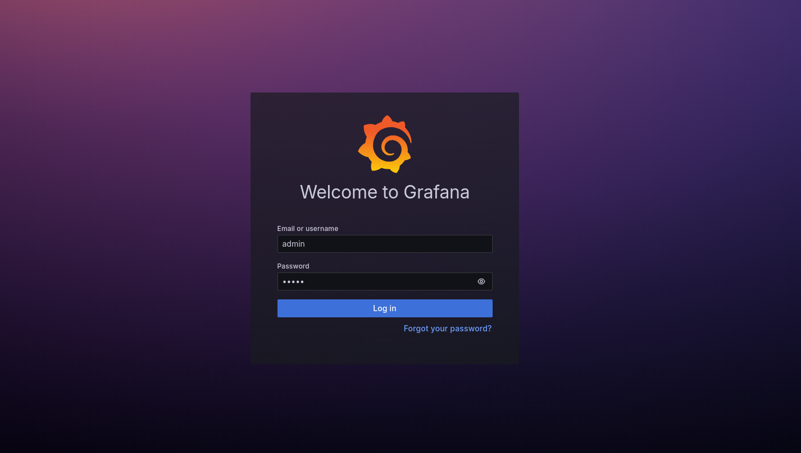
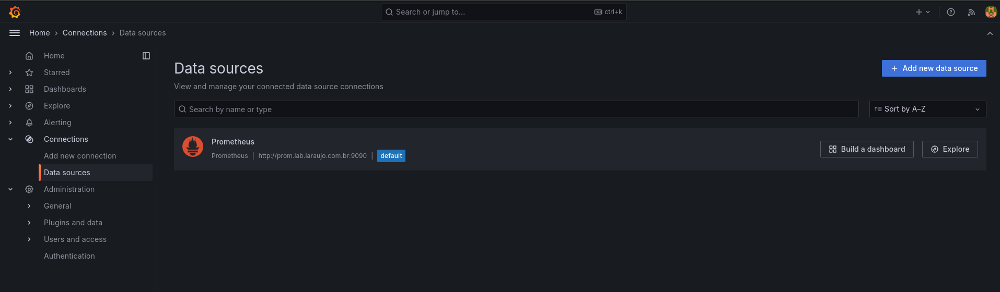
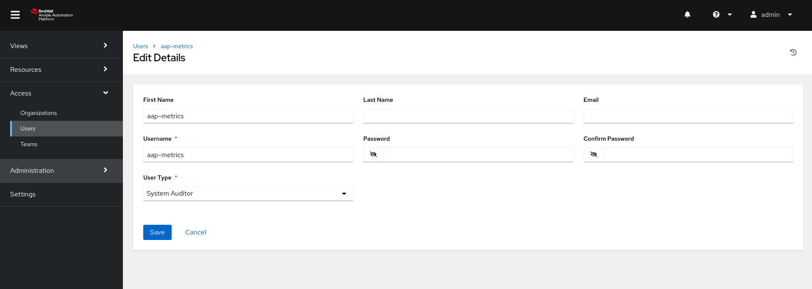
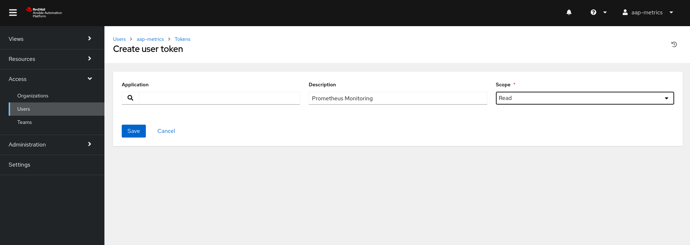
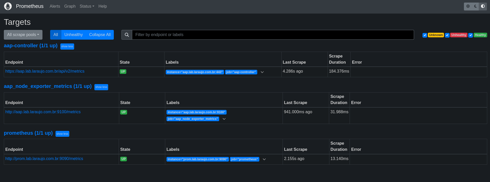
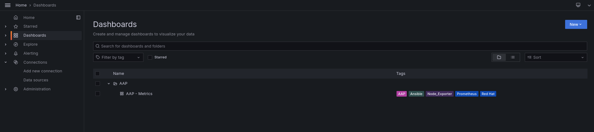
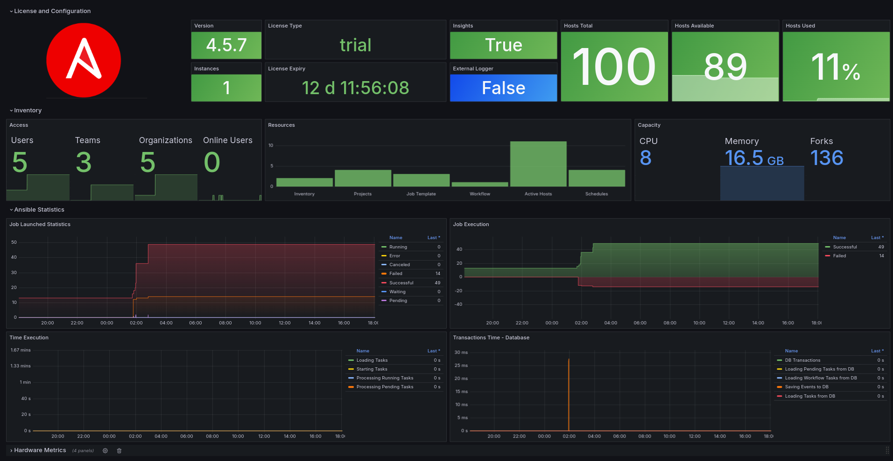
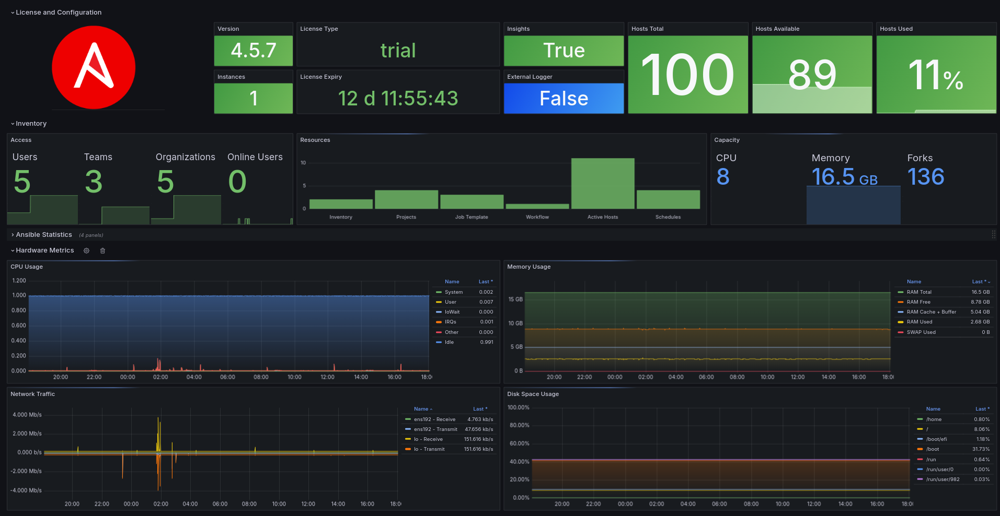

# **Monitoring Ansible Automation Platform using Prometheus,Node Exporter and Grafana**

&nbsp;

> ### In this article, I will demonstrate how to monitor Ansible Automation Platform(AAP) running on premises, using prometheus, node_exporter and grafana.
>
> In this article we use the following versions:
> - Red Hat Enterprise Linux 9.4
> - Prometheus v2.53
> - Node Exporter v1.8.1
> - Grafana v11.1.0
> - Ansible Automation Platform v4.5.7


&nbsp;

> [!IMPORTANT]
> Installation of the Ansible Automation Platform will not be covered.


&nbsp;

## **About**

- This article is aimed at users who need to have a more centralized view of the main Ansible Automation Platform usage metrics and simply identify possible situations of concern.
- In this article we will cover the installation and configuration of the following resources: Grafana, Prometheus and Node Exporter to collect data from the Operating System.
- We will use two servers, the first server will be AAP with an "All In One" installation and the second will be our Monitoring Server.


## **Procedure**

<br>

### Prometheus

<br>

> [!NOTE]
> Perform the following steps on the `Monitoring Server`

<br>

* Let's download the most updated version of Prometheus
```bash
curl -LO https://github.com/prometheus/prometheus/releases/download/v2.53.0/prometheus-2.53.0.linux-amd64.tar.gz
```
<br>

* Here we will unzip and rename our directory for ease of use
```bash
tar -xvf prometheus-2.53.0.linux-amd64.tar.gz
mv -v prometheus-2.53.0.linux-amd64 prometheus
```
<br>

* Let's create the prometheus user, create the main directories and set the prometheus user as owner
```bash
useradd --no-create-home --shell /bin/false prometheus
id prometheus

mkdir -v /etc/prometheus
mkdir -v /var/lib/prometheus

chown prometheus:prometheus /etc/prometheus
chown prometheus:prometheus /var/lib/prometheus
```
<br>

* Let's copy the prometheus and promtool binaries to the binary path and set the owner
```bash
cp -v ~/prometheus/{prometheus,promtool} /usr/local/bin/

chown prometheus:prometheus /usr/local/bin/{prometheus,promtool}
```
<br>

* Let's copy the prometheus web ui files to /etc/prometheus
```bash
cp -rpaiv ~/prometheus/{consoles,console_libraries} /etc/prometheus/

chown -R prometheus:prometheus /etc/prometheus/{consoles,console_libraries}
```
<br>

* Let's create our configuration file with our first job
```bash
cat <<EOF > /etc/prometheus/prometheus.yml
global:
  scrape_interval: 10s

scrape_configs:
  - job_name: 'prometheus'
    scrape_interval: 5s
    static_configs:
      - targets: ['192.168.0.189:9090'] # Prometheus Server IP Address
EOF

chown prometheus:prometheus /etc/prometheus/prometheus.yml
```
<br>

* Let's create a service for our prometheus and start the service
```bash
cat <<EOF > /etc/systemd/system/prometheus.service
[Unit]
Description=Prometheus
Wants=network-online.target
After=network-online.target

[Service]
User=prometheus
Group=prometheus
Type=simple
ExecStart=/usr/local/bin/prometheus \
--config.file /etc/prometheus/prometheus.yml \
--storage.tsdb.path /var/lib/prometheus/ \
--web.console.templates=/etc/prometheus/consoles \
--web.console.libraries=/etc/prometheus/console_libraries

[Install]
WantedBy=multi-user.target
EOF

systemctl daemon-reload
systemctl enable prometheus
systemctl start prometheus
```
<br>

* Let's add a rule in firewall-cmd to release port 9090, which is the default port for `prometheus`
```bash
firewall-cmd --zone=public --add-port=9090/tcp --permanent
firewall-cmd --reload
```

<br><br>

### Node Exporter

<br>

> [!NOTE]
> Perform the following steps on the `AAP Server`

<br>

* Now let's download and install the latest version of Node Exporter
```bash
curl -LO https://github.com/prometheus/node_exporter/releases/download/v1.8.1/node_exporter-1.8.1.linux-amd64.tar.gz
```
<br>

* Here we will unzip and rename our directory for ease of use
```bash
tar -xvf node_exporter-1.8.1.linux-amd64.tar.gz
mv -v node_exporter-1.8.1.linux-amd64 node_exporter
```
<br>

* Let's create the node_exporter user, create the main directories and set the prometheus user as owner
```bash
useradd --no-create-home --shell /bin/false node_exporter
id node_exporter

cp -v ~/node_exporter/node_exporter /usr/local/bin/

chown node_exporter:node_exporter /usr/local/bin/node_exporter
```
<br>

* Let's create a service for our node_exporter and start the service
```bash
cat <<EOF > /etc/systemd/system/node_exporter.service
[Unit]
Description=Node Exporter
After=network.target

[Service]
User=node_exporter
Group=node_exporter
Type=simple
ExecStart=/usr/local/bin/node_exporter

[Install]
WantedBy=multi-user.target
EOF

systemctl daemon-reload
systemctl enable node_exporter
systemctl start node_exporter
```
<br>

* Now let's add a rule in firewall-cmd to release port 9100, which is the default port for `node_exporter`
```bash
firewall-cmd --zone=public --add-port=9100/tcp --permanent
firewall-cmd --reload
```
<br>

* Now on the `Monitoring Server`, let's add a new job at the end of the file for our node_exporter and restart the prometheus service

```bash
cat <<EOF >> /etc/prometheus/prometheus.yml

  - job_name: 'aap_node_exporter_metrics'
    scrape_interval: 5s
    static_configs:
      # AAP Server
      - targets: ['aap.lab.laraujo.com.br:9100']
EOF

# Restart the prometheus service
systemctl restart prometheus
```

### Grafana

<br>

> [!NOTE]
> Perform the following steps on the `Monitoring Server`

<br>


* Let's install grafana and for this we will use the official repository, we will start by importing the gpg key
```bash
wget -q -O gpg.key https://rpm.grafana.com/gpg.key

rpm --import gpg.key
```

<br>

* Create the grafana.repo file and install the package
```bash
cat <<EOF > /etc/yum.repos.d/grafana.repo
[grafana]
name=grafana
baseurl=https://rpm.grafana.com
repo_gpgcheck=0
enabled=1
gpgcheck=0
gpgkey=https://rpm.grafana.com/gpg.key
sslverify=1
sslcacert=/etc/pki/tls/certs/ca-bundle.crt
EOF

dnf -y install grafana
```

<br>

* Let's start the grafana-server service
```bash
systemctl enable grafana-server
systemctl start grafana-server
systemctl status grafana-server
```

<br>

* Now let's add a rule in firewall-cmd to release port 3000, which is the default port for `grafana-server`
```bash
firewall-cmd --zone=public --add-port=3000/tcp --permanent

firewall-cmd --reload
```

<br>

* For our first access, use the following format: `http://<IP Address or FQDN>:3000`

> [!IMPORTANT]
> The login and password used for first access must be: <br>
> Username: `admin` and Password: `grafana`



<br>

* Now in the `grafana.ini` file, let's enable the `provisioning parameter` and modify the path to `/etc/grafana/provisioning`
```bash
vim /etc/grafana/grafana.ini

from:
;provisioning = conf/provisioning

to:
provisioning = /etc/grafana/provisioning
```

<br>

* We will integrate Grafana and Prometheus, creating a datasource that will consume Prometheus metrics, for this we will create a `prometheus.yaml` file in the provisioning path `/etc/grafana/provisioning/datasources`
```bash
cat <<EOF > /etc/grafana/provisioning/datasources/prometheus.yaml
apiVersion: 1
datasources:
  - name: Prometheus
    type: prometheus
    orgId: 1
    # IP Address or FQDN of the Monitoring Server
    url: http://prom.lab.laraujo.com.br:9090
    jsonData:
      "tlsSkipVerify": true      
    isDefault: true
    editable: true
EOF

# Set the owner to the grafana user and restart the grafana service
chown :grafana /etc/grafana/provisioning/datasources/prometheus.yaml

systemctl restart grafana-server.service
```

<br>


* To validate the creation of our Data source, in the Grafana console, go to `Connections > Data sources`



<br>

### AAP Integration

Now we are going to integrate AAP with Prometheus, with this integration, Prometheus will consume the API metrics context `/api/v2/metrics`, for this we will create a user in AAP who will be responsible for generating the token and providing this integration

* In AAP, in the left side menu, go to Access > Users > Add
  * Define a `name` and `username` that facilitates identification, here we will use `aap-metrics`.
  * Set a `password` and confirm
  * In `User Type`, select `System Auditor` and `Save`.



<br>

* Now log out and connect with the user we just created, go to Access > Users > click on the user name > Tokens > Add
  * Set a `Description` and `Scope` to `Read`
  * `Save` and copy the generated Token.



<br>

* Now on the `Monitoring Server`, let's add a new Job to `prometheus.yml`, modify the `bearer_token` generated by the aap-metrics user and add the AAP endpoint in `targets`

```bash
cat <<EOF >> /etc/prometheus/prometheus.yml

  - job_name: 'aap-controller'
    # api metrics path
    metrics_path: /api/v2/metrics
    scrape_interval: 5s
    scheme: https
    tls_config:  
      insecure_skip_verify: true
    # aap-metrics user token  
    bearer_token: xxxxxxxxxxxxxxxxx 
    static_configs:
    # AAP Endpoint
    - targets: ['aap.lab.laraujo.com.br']      
EOF

# Restart the prometheus service
systemctl restart prometheus
```
<br>

* To validate our jobs, in the Prometheus console go to Status > Targets, we will have 3 targets created, as listed below



<br>

### Grafana Dashboard

* Now let's import the Dashboard into Grafana and start monitoring our AAP, download and save `aap-metrics.json` file in the provisioning directory
```bash

# access the proviosining/dashboards directory
cd /etc/grafana/provisioning/dashboards/

# create a directory called AAP
mkdir -v AAP

# download
curl -L https://raw.githubusercontent.com/leoaaraujo/articles/master/aap-nodeexporter-grafana/files/aap-metrics.json -o AAP/aap-metrics.json

# change owner
chown :grafana AAP/aap-metrics.json
```

<br>

* Now let's create an `aap-metrics.yaml` file that will allow the automatic provisioning of our dashboard in Grafana
```bash
cat <<EOF > /etc/grafana/provisioning/dashboards/aap-metrics.yaml
apiVersion: 1
providers:
  - name: AAP-Metrics
    folder: AAP
    type: file
    options:
      # Path where our aap-metrics.json file is saved
      path:
        /etc/grafana/provisioning/dashboards/AAP
EOF

# change owner
chown :grafana /etc/grafana/provisioning/dashboards/aap-metrics.yaml

# Restart the grafana-server service
systemctl restart grafana-server.service
```

<br>

* To validate that our Dashboard was provisioned correctly, in the Grafana console, in the left side menu, click on Dashboards, we will have our dashboard provisioned in a folder called AAP.




<br>

* To view the dashboard, click on the dashboard name






<br>
<br>


## **Conclusion**

Using the Prometheus + Node Exporter + Grafana stack, we can have a complete view of the monitoring of our Ansible Automation Platform, using the integration with the AAP API, we can have a view of the day-to-day use of resources such as jobs, templates and failed or successful executions, with the Node Exporter, we can create a visualization of capacity and consumption of computational resources.

<br>

