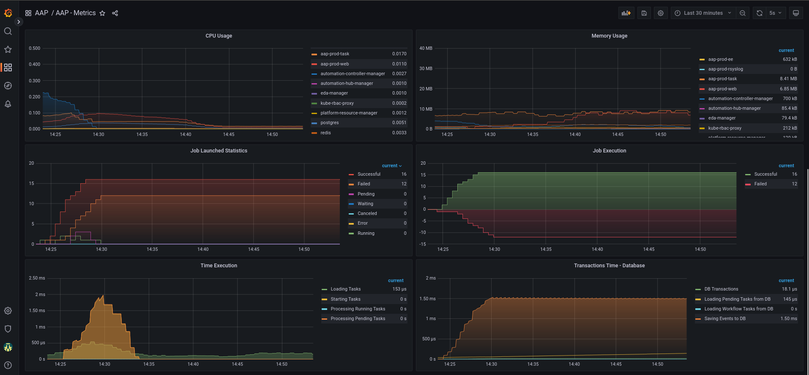

# **Monitoring Ansible Automation Platform using User-Defined Projects and Grafana**

&nbsp;

> ### In this article, I will demonstrate how to monitor Ansible Automation Platform(AAP) running on Openshift, using user-workload-monitoring with Prometheus and Grafana.
>
> In this article we use the following versions:
> - Openshift v4.13.1
> - Grafana Operator v5.4.1
> - Ansible Automation Platform v2.4


&nbsp;

| :exclamation:  Installation of the Ansible Automation Platform will not be covered. |
|------------------------------------------|


&nbsp;

## **About**

- This article is aimed at users who need to have a more centralized view of the main usage metrics of the Ansible Automation Platform and simply identify possible situations of concern. 
- In this article, we will cover resources such as Grafana, datasources and dashboards, Prometheus and ServiceMonitors to collect data dynamically.


## **Prerequisites**

- User with the cluster-admin cluster role
- Openshift 4.12 or +
- Grafana Operator
- User-Defined Projects enabled.


## **Procedure**


### **Enable user-defined projects**

- Execute this command to add `enableUserWorkload: true` under `data/config.yaml`

```shell
$ oc -n openshift-monitoring patch configmap cluster-monitoring-config -p '{"data":{"config.yaml":"enableUserWorkload: true"}}'
```

&nbsp;

- Validate that the **prometheus** and **thanos-ruler** pods were created in the **openshift-user-workload-monitoring** project

```shell
$ oc get pods -n openshift-user-workload-monitoring
NAME                                                   READY   STATUS    RESTARTS   AGE
grafana-deployment-6847648746-4mbn9                    1/1     Running   0          95m
grafana-operator-controller-manager-7f74d54f44-58pwk   1/1     Running   0          6h55m
prometheus-operator-cf59f9bdc-t7nvm                    2/2     Running   0          7h6m
prometheus-user-workload-0                             6/6     Running   0          7h6m
prometheus-user-workload-1                             6/6     Running   0          7h6m
thanos-ruler-user-workload-0                           4/4     Running   0          7h6m
thanos-ruler-user-workload-1                           4/4     Running   0          7h6m
```

&nbsp;

### **Install Grafana Operator**

- Using the **WebConsole**, in the left side menu, select **OperatorHub** and then in the search field, search for **Grafana Operator**.
- Make sure to change the project context to **openshift-user-workload-monitoring** at the top.
- Click on the operator, click on **Install**.


&nbsp;

- In **Update Channel**, select **v5**
- In **Installation Mode**, select **A specific namespace on the cluster** and choose **openshift-user-workload-monitoring** below.
- In **Update approval**, select **Automatic**
- Click **Install**.


&nbsp;

- Now let's create a service account and assign permission to read metrics.

```shell
$ oc project openshift-user-workload-monitoring
$ oc create sa grafana-sa
$ oc adm policy add-cluster-role-to-user cluster-monitoring-view -z grafana-sa
```

- Let's collect the grafana-sa serviceaccount token and create a secret for our Grafana instance.

```shell
$ SECRET=`oc -n openshift-user-workload-monitoring describe sa grafana-sa | awk '/Tokens/{ print $2 }'`

$ TOKEN=`oc -n openshift-user-workload-monitoring get secret $SECRET --template='{{ .data.token | base64decode }}'`

$ cat <<EOF > grafana-secret-creds.yaml
kind: Secret
apiVersion: v1
metadata:
  name: credentials
  namespace: openshift-user-workload-monitoring
stringData:
  GF_SECURITY_ADMIN_PASSWORD: grafana   <------ Set the password you want to authenticate with Grafana
  GF_SECURITY_ADMIN_USER: root          <------ Set the desired user to authenticate in Grafana
  PROMETHEUS_TOKEN: '${TOKEN}'          <------ This variable will receive the token collected above
type: Opaque
EOF

$ oc create -f grafana-secret-creds.yaml
```
&nbsp;

- Now let's create our Grafana instance and it will read the credentials defined in the previously created secret.

```shell
$ cat <<EOF > grafana-instance.yaml
apiVersion: grafana.integreatly.org/v1beta1
kind: Grafana
metadata:
  name: grafana
  labels:
    dashboards: "grafana"
    folders: "grafana"
spec:
  deployment:
    spec:
      template:
        spec:
          containers:
            - name: grafana
              env:
                - name: GF_SECURITY_ADMIN_USER
                  valueFrom:
                    secretKeyRef:
                      key: GF_SECURITY_ADMIN_USER
                      name: credentials
                - name: GF_SECURITY_ADMIN_PASSWORD
                  valueFrom:
                    secretKeyRef:
                      key: GF_SECURITY_ADMIN_PASSWORD
                      name: credentials
  config:
    auth:
      disable_login_form: "false"
      disable_signout_menu: "true"
    auth.anonymous:
      enabled: "false"
    log:
      level: warn
      mode: console
EOF
```

&nbsp;

- Let's apply and validate our created Instance
```shell
$ oc -n openshift-user-workload-monitoring create -f grafana-instance.yaml

$ oc -n openshift-user-workload-monitoring get pods -l app=grafana
NAME                                 READY   STATUS    RESTARTS   AGE
grafana-deployment-c4959687c-7vg9d   1/1     Running   0          6m24s
```

&nbsp;

- Now let's expose our grafana service using an edge type route, we will use the service called **grafana-service**.

```shell
$ oc -n openshift-user-workload-monitoring get svc
NAME                                        TYPE        CLUSTER-IP       EXTERNAL-IP   PORT(S)                       AGE
grafana-operator-operator-metrics-service   ClusterIP   172.30.37.111    <none>        8443/TCP                      7h1m
grafana-service                             ClusterIP   172.30.244.194   <none>        3000/TCP                      6h16m
prometheus-operated                         ClusterIP   None             <none>        9090/TCP,10901/TCP            7h12m
prometheus-operator                         ClusterIP   None             <none>        8443/TCP                      7h12m
prometheus-user-workload                    ClusterIP   172.30.159.129   <none>        9091/TCP,9092/TCP,10902/TCP   7h12m
prometheus-user-workload-thanos-sidecar     ClusterIP   None             <none>        10902/TCP                     7h12m
thanos-ruler                                ClusterIP   172.30.213.131   <none>        9091/TCP,9092/TCP,10901/TCP   7h12m
thanos-ruler-operated                       ClusterIP   None             <none>        10902/TCP,10901/TCP           7h12m


$ oc -n openshift-user-workload-monitoring create route edge grafana --service=grafana-service --insecure-policy=Redirect
```
&nbsp;

- Displaying the route exposed to Grafana

```shell
$ oc -n openshift-user-workload-monitoring get route grafana -o jsonpath='{.spec.host}'
```
&nbsp;

- Let's create our **Grafana Datasource**, which will connect to **thanos-querier** in the **openshift-monitoring** project and will use the **grafana-sa** serviceaccount token that is stored in secret **credentials**.

```shell
$ cat <<EOF > grafana-datasource.yaml
apiVersion: grafana.integreatly.org/v1beta1
kind: GrafanaDatasource
metadata:
  name: grafana-ds
  namespace: openshift-user-workload-monitoring  
spec:
  valuesFrom:
    - targetPath: "secureJsonData.httpHeaderValue1"
      valueFrom:
        secretKeyRef:
          name: "credentials"
          key: "PROMETHEUS_TOKEN"
  instanceSelector:
    matchLabels:
      dashboards: "grafana"
  datasource:
    name: Prometheus
    type: prometheus
    access: proxy
    url: https://thanos-querier.openshift-monitoring.svc:9091
    isDefault: true
    jsonData:
      "tlsSkipVerify": true
      "timeInterval": "5s"
      httpHeaderName1: 'Authorization'
    secureJsonData:
      "httpHeaderValue1": "Bearer ${PROMETHEUS_TOKEN}"
    editable: true
EOF
```

&nbsp;

- Let's apply and validate our created Datasource
```shell
$ oc -n openshift-user-workload-monitoring create -f grafana-datasource.yaml

$ oc -n openshift-user-workload-monitoring get GrafanaDatasource  
NAME         NO MATCHING INSTANCES   LAST RESYNC   AGE
grafana-ds                           119s          3d23h
```


&nbsp;

- To validate our created datasource using Grafana Console, use the edge route created previously and access via browser, authenticate using the username and password added in secret credentials. 
- Once authenticated, click **Configuration** > **Data sources**


&nbsp;

### **Creating User in Ansible Automation Platform**

- Access the AAP console and let's create a user for our monitoring.
- To do this, in the left side menu, click on **Users** > **Add**


&nbsp;

- To generate the token, authenticate to AAP using the created user and then click on Users > click on the name of the created user > **Token** > **Add**
- Define a **description** and **scope** as **read** and click **Save**, then a popup will be displayed with the token, copy and save.


&nbsp;

### **Creating Prometheus ServiceMonitor** 

- Let's create a **ServiceMonitor** to collect metrics from our **AAP** and export through our **Prometheus** and **Thanos Querier**.
- First, let's create a secret to store our bearer token, previously collected in **AAP** with the user **aap-metrics**.

```shell
$ oc create secret generic aap-monitor-creds --from-literal=token={{ YOUR AAP BEARER TOKEN }} -n aap
```
&nbsp;

- Now let's create **ServiceMonitor**, which will discover the AAP service and collect the metrics that are in the path **/api/v2/metrics**.

```shell
$ cat <<EOF > svc-monitor-aap.yaml
apiVersion: monitoring.coreos.com/v1
kind: ServiceMonitor
metadata:
  name: aap-monitor
  namespace: aap
spec:
  endpoints:
  - interval: 30s
    scrapeTimeout: 10s
    honor_labels: true  
    path: /api/v2/metrics/
    port: http
    scheme: http
    bearerTokenSecret:  
      key: token
      name: aap-monitor-creds   <------ Secret previously created with our Bearer Token      
  namespaceSelector:
    matchNames:
    - aap         
  selector:
    matchLabels:
      app.kubernetes.io/component: automationcontroller
EOF
```

&nbsp;

- Now let's apply and validate our created ServiceMonitor 

```shell
$ oc create -f svc-monitor-aap.yaml

$ oc get servicemonitor -n aap                              
NAME          AGE
aap-monitor   31m
```

&nbsp;

- To validate using the **WebConsole**, in the left side menu, click on **Targets** in the **Observe** Session, in Filter select **User**.


&nbsp;

- Still in the **Observe** section, click on **Metrics**, we will identify whether the AAP metrics are arriving correctly, use any metric starting with **awx_**, for example **awx_instance_info**


&nbsp;

### **Creating Grafana Dashboard**

- Now let's create a grafana dashboard, which will fetch the json externally from github.

```shell
$ cat <<EOF > grafana-dashboard-aap.yaml
apiVersion: grafana.integreatly.org/v1beta1
kind: GrafanaDashboard
metadata:
  name: grafana-dashboard-aap
  labels:
    app: grafana
spec:
  instanceSelector:
    matchLabels:
      dashboards: grafana  
  folder: "AAP"      
url: https://raw.githubusercontent.com/leoaaraujo/aap-dashboard/main/aap-dash.json
EOF
```
&nbsp;

- Let's apply and validate our created GrafanaDashboard

```shell
$ oc -n openshift-user-workload-monitoring create -f grafana-dashboard-aap.yaml


$ oc -n openshift-user-workload-monitoring get grafanadashboard
NAME                    NO MATCHING INSTANCES   LAST RESYNC   AGE
grafana-dashboard-aap                           3s            145m
```

&nbsp;

### **Viewing the Dashboard**

- Access Grafana, in the left side menu, click on **Dashboards** and then on **Browse**
- A folder with the name **AAP** and the dashboard **AAP - Metrics** will be displayed, click on dashboard.


&nbsp;

- Dashboard


&nbsp;



## **Conclusion**

Using User-Defined Projects from the Openshift Monitoring stack, we created monitoring for the Ansible Automation Platform, using a Grafana Dashboard, to visualize usage metrics and statistics, such as subscription information, playbook metrics, users and resource consumption within Openshift.

&nbsp;

## **References**

For more details and other configurations, start with the reference documents below.

- [Enabling monitoring for user-defined projects](https://docs.openshift.com/container-platform/4.13/monitoring/enabling-monitoring-for-user-defined-projects.html)
- [Grafana Operator](https://grafana-operator.github.io/grafana-operator/docs/)
- [Specifying how a service is monitored](https://docs.openshift.com/container-platform/4.13/monitoring/managing-metrics.html#specifying-how-a-service-is-monitored_managing-metrics)
