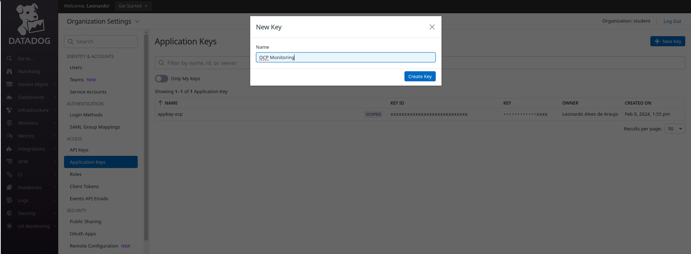

# **How to monitoring Openshift using Datadog Operator**


&nbsp;

> ### In this article, I will demonstrate how to integrate Openshift with Datadog using `datadog operator` to collect metrics,logs and events.
>
> In this article we use the following versions:
> - Openshift v4.13.11
> - Datadog Operator v1.3.0


&nbsp;

## **About**

- This article is aimed at users who would like to integrate or monitor their `Openshift Cluster` using the `Datadog monitoring solution`.

- We will use the datadog operator to instantiate our agent and collect all metrics, cluster and container/pod logs, network, cpu and memory consumption.


## **Prerequisites**

- User with the cluster-admin cluster role
- Openshift 4.10 or +
- Datadog Account


## **Procedure**

### Datadog

#### Add api keys

- To add a new `datadog api key`, navigate to `Organization Settings` > `Api Keys`
- If you have the permission to create api keys, click `New Key` in the top right corner.
- Define the desired name, something that can help you identify in the future.
- Once created, copy the Key so we can use it later.


#### Add application keys

- To add a new `datadog application key`, navigate to `Organization Settings` > `Application Keys`
- If you have the permission to create api keys, click `New Key` in the top right corner.
- Define the desired name, something that can help you identify in the future.
- Once created, copy the Key so we can use it later.




### Openshift

#### Datadog Operator Install

- In the Openshift console, in the left side menu, click `Operator` > `OperatorHub` > in the `search field`, type `datadog`


| :warning: Whenever available, use a certified option. |
|------------------------------------------|


&nbsp;

- As we can see, we are using version 1.3.0 of operator, click `Install`.


&nbsp;

- On this screen, we will keep all the default options:
    - Update channel: `stable`
    - Installation mode: `All namespaces the cluster(default)`
    - Installed Namespace: `openshift-operators`
    - Update approval: `Automatic` 
        - Obs.: _If you prefer, you can use the Manual option._
    - Click `Install`.    


&nbsp;

- Wait until the installation is complete.


#### Create secret with datadog keys

- In the terminal, access the openshift-operators namespace context

```bash
$ oc project openshift-operators
```

&nbsp;

- Now let's create a secret to store in this API Key and Application Key, replace the values below with the keys we generated previously in the Datadog console.

```bash
$ oc create secret generic datadog-secret \
--from-literal api-key=`REPLACE_ME` \
--from-literal app-key=`REPLACE_ME`
```

&nbsp;

- Let's now create our datadog agent using the yaml below

```bash
$ cat <<EOF > datadog_agent.yaml
apiVersion: datadoghq.com/v2alpha1
kind: DatadogAgent
metadata:
  name: datadog
  namespace: openshift-operators
spec:
  features:
    apm:
      enabled: true
      unixDomainSocketConfig:
        enabled: true
    clusterChecks:
      enabled: true
      useClusterChecksRunners: true
    dogstatsd:
      originDetectionEnabled: true
      unixDomainSocketConfig:
        enabled: true
    eventCollection:
      collectKubernetesEvents: true
    liveContainerCollection:
      enabled: true
    liveProcessCollection:
      enabled: true
    logCollection:
      containerCollectAll: true
      enabled: true
    npm:
      collectDNSStats: true
      enableConntrack: true
      enabled: true
  global:
    clusterName: DemoLab
    credentials:
      apiSecret:
        keyName: api-key
        secretName: datadog-secret
      appSecret:
        keyName: app-key
        secretName: datadog-secret
    criSocketPath: /var/run/crio/crio.sock
    kubelet:
      tlsVerify: false
    site: datadoghq.eu
  override:
    clusterAgent:
      containers:
        cluster-agent:
          securityContext:
            readOnlyRootFilesystem: false
      replicas: 2
      serviceAccountName: datadog-agent-scc
    nodeAgent:
      hostNetwork: true
      securityContext:
        runAsUser: 0
        seLinuxOptions:
          level: s0
          role: system_r
          type: spc_t
          user: system_u
      serviceAccountName: datadog-agent-scc
      tolerations:
      - operator: Exists
      - effect: NoSchedule
        key: node-role.kubernetes.io/master
EOF        
```

- Some explanations about what we are enabling in this agent

Enabling the `APM`` (_Application Performance Management_) feature
```yaml
apm:
  enabled: true
  unixDomainSocketConfig:
    enabled: true
```

&nbsp;

`Cluster Check` extends the autodiscover function to non-containerized resources
```yaml
clusterChecks:
  enabled: true
  useClusterChecksRunners: true
```

&nbsp;

`Dogstatsd` is responsible for collecting custom metrics and events and sending them from time to time to a metrics aggregation service on the Datadog server.
```yaml
dogstatsd:
  originDetectionEnabled: true
  unixDomainSocketConfig:
    enabled: true
```
&nbsp;

Here we are enabling the collection of all logs (including container logs) and events generated in our cluster and sending them to Datadog.
```yaml
eventCollection:
  collectKubernetesEvents: true
liveContainerCollection:
  enabled: true
liveProcessCollection:
  enabled: true
logCollection:
  containerCollectAll: true
  enabled: true
```

&nbsp;

With `NPM` (_Network Performance Monitoring_), we can have visibility of all traffic in our cluster, nodes, containers, availability zones, etc.
```yaml
npm:
  collectDNSStats: true
  enableConntrack: true
  enabled: true
```

&nbsp;

`Global`, here we are defining our secret to authorize communication with Datadog servers, communication with our Kubelet without certificate validation, adjustments regarding the Security Context, enabling hostNetwork, our serviceaccount already with scc assigned by the operator and tolerations so that it can be executed on our masters nodes too.

&nbsp;

- After some explanations, let's create our datadog agent, execute this command to create this object:
```bash
$ oc -n openshift-operators create -f datadog_agent.yaml
```

- Once created, we will validate that our agent was created correctly

```bash
$ oc -n openshift-operators get datadogagent
$ oc -n openshift-operators get pods
```

Obs.: Here we should have a datadog-agent running on each available openshift node.


&nbsp;

- Now let's validate the logs of the datadog-agent-xxxxx pods, to identify if there is any communication error.

```bash
$ oc logs -f -l app.kubernetes.io/managed-by=datadog-operator --max-log-requests 10
```


&nbsp;

### Datadog Dashboard

- Now on the Datadog dashboard, in the left side menu, click on `Infrastructure` > and then on `Infrastructure List`


| :warning: Server data, such as status, cpu information, memory and other details, may take a few minutes to be displayed. |
|------------------------------------------|


&nbsp;

- To view more details about a specific node, click on the node name and navigate through the available tabs.


&nbsp;

- To view more details about network traffic, in the left side menu, go to `Infrastructure` > `Network Map`


&nbsp;

- To view the logs received from the cluster, in the left side menu, go to `Logs` > `Analytics`, on this screen, we can view all the details, filter application logs and even view the processes.


&nbsp;

- To view all collected metrics, in the left side menu, go to `Metrics` > `Explorer`, here we can view all metrics, run and save queries or create dashboards based on queries.


&nbsp;

- Datadog provides ready-made dashboards that can be used and customized. To use one available, in the left side menu, go to `Dashboards` > `Dashboard List` > choose the dashboard and click on the name.


Obs.: To customize a dashboard provided by Datadog, use the Clone feature to make the desired changes and save.

&nbsp;
&nbsp;

## **Conclusion**

Using the Datadog Operator solution, we can have a complete monitoring solution for our Openshift cluster with main features such as APM, Network Analysis, Logs, Events and Metrics.

&nbsp;

## **References**

For more details and other configurations, start with the reference documents below.

- [Red Hat Catalog - Datadog Operator](hhttps://catalog.redhat.com/software/containers/datadog/operator/5e845a42ecb5246c09fe90b6)
- [Datadog Documentation - Openshift](https://docs.datadoghq.com/integrations/openshift/?tab=operator)
- [Datadog Documentation - Advanced setup for Datadog Operator](https://docs.datadoghq.com/containers/guide/operator-advanced/)


