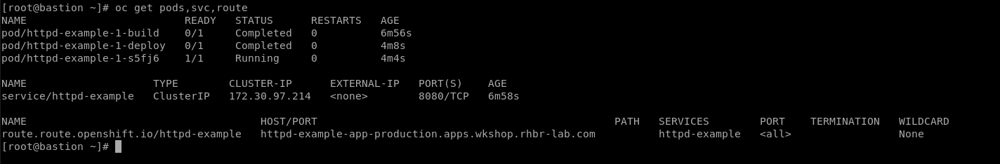
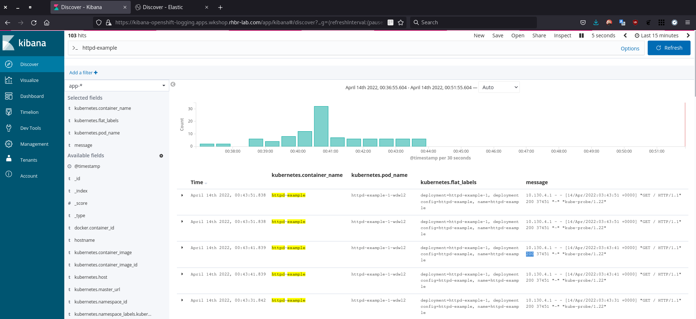
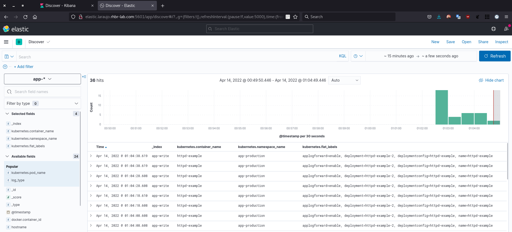
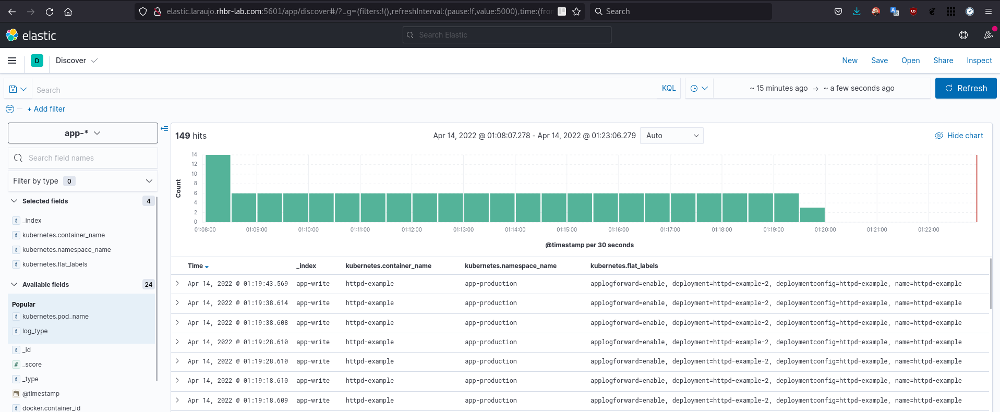
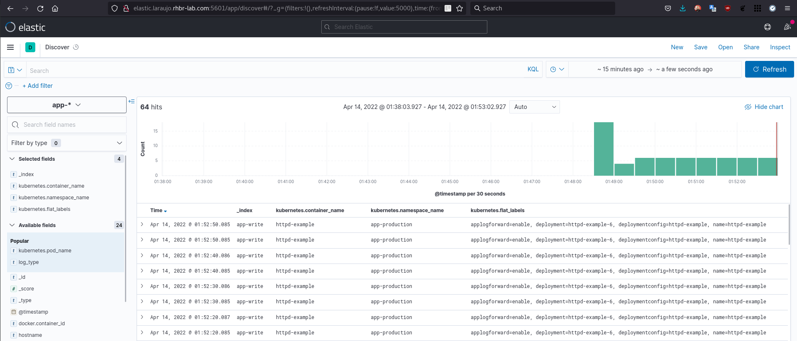

# Openshift Logging Forward On-Demand for Applications

&nbsp;

> In this article I will demonstrate a strategy on how to logforward for certain applications on demand.

&nbsp;

In this article, we will use the LogForward feature of the Openshift Logging stack, to forward the logs of certain applications to an external solution, which in this case, we will use an Elasticsearch server.

&nbsp;

> **Note:** Installing and configuring Elasticsearch will not be covered in this article.

&nbsp;

**Let's Go Work !!!**

&nbsp;


## Prerequisites

&nbsp;

Let's validate and ensure that our elasticsearch is accessible and functional:

&nbsp;

* Validating cluster health output command
 
```json
[root@elastic-server ~]# curl elastic-server:9200/_cluster/health?pretty
{
  "cluster_name" : "ES-CLUSTER",
  "status" : "green",
  "timed_out" : false,
  "number_of_nodes" : 1,
  "number_of_data_nodes" : 1,
  "active_primary_shards" : 24,
  "active_shards" : 24,
  "relocating_shards" : 0,
  "initializing_shards" : 0,
  "unassigned_shards" : 0,
  "delayed_unassigned_shards" : 0,
  "number_of_pending_tasks" : 0,
  "number_of_in_flight_fetch" : 0,
  "task_max_waiting_in_queue_millis" : 0,
  "active_shards_percent_as_number" : 100.0
}
```

&nbsp;

* Listing all indices created

```shell
[root@elastic-server ~]# curl elastic-server:9200/_cat/indices
green open .kibana_7.12.1_001              ylb-smFzS529Tz2hWX-QSQ 1 0   107 2078  4.6mb  4.6mb
green open .transform-internal-006         Z-gIINnJQvqHBE8A-nGJeg 1 0     0    0   231b   231b
green open .apm-agent-configuration        kWLkvg55RW68ZPY7ngnRQQ 1 0     0    0   208b   208b
green open .kibana-event-log-7.12.1-000007 FzQWuM9gQG-LVdDJoF178w 1 0     2    0   11kb   11kb
green open gl-events_1                     IqDQXNOlQBiZ_VpyrRQWgQ 2 0     0    0   416b   416b
green open gl-events_0                     lNpZXwK7RLKZJ8R8qjGIDg 2 0     0    0   416b   416b
green open .kibana_task_manager_7.12.1_001 YyRzWFAnTFGoHwTKAjgmsQ 1 0     9 3485    2mb    2mb
green open .kibana-event-log-7.12.1-000005 ymxIKPPhRGSMP6jhsP8xQw 1 0     0    0   208b   208b
green open .kibana-event-log-7.12.1-000006 YtKhTJ1oQaa3_gQ7z6ohTA 1 0     3    0 11.3kb 11.3kb
green open .tasks                          kDIaPp9tTfao1PlgX866Rg 1 0    11    0 62.7kb 62.7kb
green open .apm-custom-link                mThLM2yBSY6yzduSfyHvIQ 1 0     0    0   208b   208b
green open graylog_0                       n5KlVWLRQxS777prOpVbsw 2 0 14002    0  3.4mb  3.4mb
green open gl-system-events_0              JKP9Bl10T9mcEXxLyhV98Q 2 0     0    0   416b   416b
green open .async-search                   vglkgODpSNyXKKi22uvvnw 1 0    42 1584 30.8mb 30.8mb
green open gl-system-events_1              jteCL5FPR-iXuP42hIzzdg 2 0     0    0   416b   416b
```

&nbsp;

## LogForwarder

&nbsp;

Now let's create our logforwarder instance on the openshift-logging stack.

&nbsp;

Before that, let's analyze the yaml below:

&nbsp;

* This is the initial block of our yaml, where we are specifying which `api` will be used, `kind`, `name` of my instance, where the default is `instance` and in which `namespace` this object needs to be created:

```yaml
apiVersion: logging.openshift.io/v1
kind: ClusterLogForwarder
metadata:
  name: instance
  namespace: openshift-logging
spec:
```

&nbsp;

* In this block, we are defining the Input, which is the input filter that we want to search in the generated logs. 
Here, we are looking at the `application` logs, that is, we will scan all the applications that will be running and we will look for this label "`applogforward: enable`".

```yaml
  inputs:
  - application:
      selector:
        matchLabels:
          applogforward: enable
    name: AppLogsForward
```

&nbsp;

* `Pipelines`, defines what will be the routing of my logs, based on my `inputs` and `outputs`. 
Where in this block I am specifying that the `AppLogsForward input` block should be forwarded to my `remote-elasticsearch output`.

```yaml
  pipelines:
  - inputRefs:
    - AppLogsForward
    name: appslogforward
    outputRefs:
    - remote-elasticsearch
```

&nbsp;

* Still in the Pipelines block, let's create a second block informing that my standard inputs must be forwarded to my standard output.
    * **Default Input**: *application, infrastructure and audit*
    * **Default Output**: *default (internal elasticsearch)*

```yaml
  - inputRefs:
    - application
    - infrastructure
    - audit
    name: enable-default-log-store
    outputRefs:
    - default
```    

&nbsp;

* Now that we understand the blocks and their functions, let's create our instance

```yaml
apiVersion: logging.openshift.io/v1
kind: ClusterLogForwarder
metadata:
  name: instance
  namespace: openshift-logging
spec:
  inputs:
  - application:
      selector:
        matchLabels:
          applogforward: enable
    name: AppLogsForward
  outputs:
  - name: remote-elasticsearch
    type: elasticsearch
    url: http://elastic.laraujo.rhbr-lab.com:9200
  pipelines:
  - inputRefs:
    - AppLogsForward
    name: appslogforward
    outputRefs:
    - remote-elasticsearch
  - inputRefs:
    - application
    - infrastructure
    - audit
    name: enable-default-log-store
    outputRefs:
    - default
```    

&nbsp;

* After saving our yaml, let's run the command below and create our instance


```shell
[root@bastion ~]# oc project openshift-logging

[root@bastion ~]# oc create -f clusterlogforwarder-instance.yaml 
clusterlogforwarder.logging.openshift.io/instance created

[root@bastion ~]# oc get clusterlogforwarders
```   


&nbsp;

* To validate if our instance was created correctly and is functional, let's execute the command below and analyze the object's status

```shell
[root@bastion ~]# oc describe clusterlogforwarders instance
.......
Status:
  Conditions:
    Last Transition Time:  2022-04-14T03:28:39Z
    Status:                True
    Type:                  Ready
  Inputs:
    App Logs Forward:
      Last Transition Time:  2022-04-14T03:28:39Z
      Status:                True
      Type:                  Ready
    Application:
      Last Transition Time:  2022-04-14T03:28:39Z
      Status:                True
      Type:                  Ready
    Audit:
      Last Transition Time:  2022-04-14T03:28:39Z
      Status:                True
      Type:                  Ready
    Infrastructure:
      Last Transition Time:  2022-04-14T03:28:39Z
      Status:                True
      Type:                  Ready
  Outputs:
    Default:
      Last Transition Time:  2022-04-14T03:28:39Z
      Status:                True
      Type:                  Ready
    Remote - Elasticsearch:
      Last Transition Time:  2022-04-14T03:28:39Z
      Status:                True
      Type:                  Ready
  Pipelines:
    Appslogforward:
      Last Transition Time:  2022-04-14T03:28:39Z
      Status:                True
      Type:                  Ready
    Enable - Default - Log - Store:
      Last Transition Time:  2022-04-14T03:28:39Z
      Status:                True
      Type:                  Ready
```

> *At this stage of the process, we are still not forwarding anything to our external elasticsearch, now let's run some tests.*

&nbsp;


## Let's Go Test


* Let's now create an application and generate some logs

```shell
[root@bastion ~]# oc new-project app-production
[root@bastion ~]# oc new-app --template=httpd-example --name=httpd-app-prod
--> Deploying template "openshift/httpd-example" to project app-production

     Apache HTTP Server
     ---------
     An example Apache HTTP Server (httpd) application that serves static content. For more information about using this template, including OpenShift considerations, see https://github.com/sclorg/httpd-ex/blob/master/README.md.

     The following service(s) have been created in your project: httpd-example.
     
     For more information about using this template, including OpenShift considerations, see https://github.com/sclorg/httpd-ex/blob/master/README.md.

     * With parameters:
        * Name=httpd-example
        * Namespace=openshift
        * Memory Limit=512Mi
        * Git Repository URL=https://github.com/sclorg/httpd-ex.git
        * Git Reference=
        * Context Directory=
        * Application Hostname=
        * GitHub Webhook Secret=GxI3k5Ha2e0qrK1Ndp1HiFx44RQDwqNbFQosNhDH # generated
        * Generic Webhook Secret=VqICvhTYOkA4tOrGT1mYmJpL05YUTLlNr2QxpsgY # generated

--> Creating resources ...
    service "httpd-example" created
    route.route.openshift.io "httpd-example" created
    imagestream.image.openshift.io "httpd-example" created
    buildconfig.build.openshift.io "httpd-example" created
    deploymentconfig.apps.openshift.io "httpd-example" created
--> Success
    Access your application via route 'httpd-example-app-production.apps.wkshop.rhbr-lab.com'
    Build scheduled, use 'oc logs -f buildconfig/httpd-example' to track its progress.
    Run 'oc status' to view your app.

[root@bastion ~]# oc get pods,svc,route
```



&nbsp;

*  To ensure that our application is functional and returning code 200, let's execute the call below

```shell
[root@bastion ~]# curl -I httpd-example-app-production.apps.wkshop.rhbr-lab.com
HTTP/1.1 200 OK
date: Thu, 14 Apr 2022 03:46:24 GMT
server: Apache/2.4.37 (Red Hat Enterprise Linux) OpenSSL/1.1.1k
last-modified: Thu, 14 Apr 2022 03:40:23 GMT
etag: "924b-5dc950dc7f7c0"
accept-ranges: bytes
content-length: 37451
content-type: text/html; charset=UTF-8
set-cookie: 1f84c9ae7b3f6216009d11186edc451c=f0666b4a37d979a37bfc620b52102c60; path=/; HttpOnly
cache-control: private
```

&nbsp;

* Accessing Openshift's internal kibana and filtering the name of our application, we can see that it is not being forwarded to our external elasticsearch.



&nbsp;

* Knowing that our LogForwarder is looking for the "`applogforward: enable`" label in applications, let's add it and see what happens

  * Run the command below to add the label to the deploymentconfig of our test application:

```shell
[root@bastion ~]# oc get dc
NAME            REVISION   DESIRED   CURRENT   TRIGGERED BY
httpd-example   1          1         1         config,image(httpd-example:latest)

[root@bastion ~]# oc get pods
NAME                     READY   STATUS      RESTARTS   AGE
httpd-example-1-build    0/1     Completed   0          24m
httpd-example-1-deploy   0/1     Completed   0          22m
httpd-example-1-s5fj6    1/1     Running     0          21m
```
&nbsp;

```json
[root@bastion ~]# oc patch dc httpd-example --type merge --patch '{"spec":{"template":{"metadata":{"labels":{"applogforward": "enable"}}}}}'
deploymentconfig.apps.openshift.io/httpd-example patched
```
&nbsp;
```shell
[root@bastion ~]# oc get dc
NAME            REVISION   DESIRED   CURRENT   TRIGGERED BY
httpd-example   2          1         1         config,image(httpd-example:latest)

[root@bastion ~]# oc get pods
NAME                     READY   STATUS      RESTARTS   AGE
httpd-example-1-build    0/1     Completed   0          25m
httpd-example-1-deploy   0/1     Completed   0          22m
httpd-example-2-deploy   0/1     Completed   0          26s
httpd-example-2-rxdzq    1/1     Running     0          22s

[root@bastion ~]# oc get pods -l applogforward=enable
NAME                    READY   STATUS    RESTARTS   AGE
httpd-example-2-rxdzq   1/1     Running   0          87s
```

&nbsp;

* When re-validating the external Elasticsearch, we can identify that a new index was created `app-write`, this is the index created by LogForwarder to receive the forwarded data.

```shell
[root@elastic-server ~]# curl elastic-server:9200/_cat/indices
green  open .kibana_7.12.1_001              ylb-smFzS529Tz2hWX-QSQ 1 0    90 3870   4.8mb   4.8mb
green  open .transform-internal-006         Z-gIINnJQvqHBE8A-nGJeg 1 0     0    0    231b    231b
green  open .apm-agent-configuration        kWLkvg55RW68ZPY7ngnRQQ 1 0     0    0    208b    208b
green  open gl-events_1                     IqDQXNOlQBiZ_VpyrRQWgQ 2 0     0    0    416b    416b
green  open .kibana-event-log-7.12.1-000007 FzQWuM9gQG-LVdDJoF178w 1 0     2    0    11kb    11kb
green  open gl-events_0                     lNpZXwK7RLKZJ8R8qjGIDg 2 0     0    0    416b    416b
green  open .kibana_task_manager_7.12.1_001 YyRzWFAnTFGoHwTKAjgmsQ 1 0     9 5121   2.2mb   2.2mb
green  open .kibana-event-log-7.12.1-000005 ymxIKPPhRGSMP6jhsP8xQw 1 0     0    0    208b    208b
yellow open app-write                       6fWJ9kYERVqbUevw1XWrhw 1 1    46    0 227.8kb 227.8kb
green  open .kibana-event-log-7.12.1-000006 YtKhTJ1oQaa3_gQ7z6ohTA 1 0     3    0  11.3kb  11.3kb
green  open .tasks                          kDIaPp9tTfao1PlgX866Rg 1 0    11    0  62.7kb  62.7kb
green  open .apm-custom-link                mThLM2yBSY6yzduSfyHvIQ 1 0     0    0    208b    208b
green  open graylog_0                       n5KlVWLRQxS777prOpVbsw 2 0 14002    0   3.4mb   3.4mb
green  open gl-system-events_0              JKP9Bl10T9mcEXxLyhV98Q 2 0     0    0    416b    416b
green  open gl-system-events_1              jteCL5FPR-iXuP42hIzzdg 2 0     0    0    416b    416b
green  open .async-search                   vglkgODpSNyXKKi22uvvnw 1 0    33 2736  31.2mb  31.2mb


[root@elastic-server ~]# curl 'elastic-server:9200/_cat/indices/app-*?v=true&s=index'
health status index     uuid                   pri rep docs.count docs.deleted store.size pri.store.size
yellow open   app-write 6fWJ9kYERVqbUevw1XWrhw   1   1         48            0    227.8kb        227.8kb
```

&nbsp;

* When accessing kibana from our external environment, we can already view the information of our application, including knowing that we are revision 2 "`httpd-example-2`"



&nbsp;

* If I change the value of our label to disable, for example "`applogforward=disable`", we will be able to see through kibana that the ones are no longer arriving.

  * Run the command below to change the label value:

```shell
[root@bastion ~]# oc patch dc httpd-example --type='json' --patch '[{"op": "replace", "path": "/spec/template/metadata/labels/applogforward", "value": "disable"}]'
deploymentconfig.apps.openshift.io/httpd-example patched

[root@bastion ~]# oc get dc
NAME            REVISION   DESIRED   CURRENT   TRIGGERED BY
httpd-example   4          1         1         config,image(httpd-example:latest)

[root@bastion ~]# oc get pods -l applogforward=enable
No resources found in app-production namespace.

[root@bastion ~]# oc get pods -l applogforward=disable
NAME                    READY   STATUS    RESTARTS   AGE
httpd-example-4-9q5rp   1/1     Running   0          27s
```

&nbsp;


* After changing our label, we can see that the logs have already stopped arriving in our external Elasticsearch and are back to being collected by Openshift's internal Elasticsearch




&nbsp;

* When we update our label again to the value "enable", the logs are forwarded again to the external Elasticsearch

```shell
[root@bastion ~]# oc patch dc httpd-example --type='json' --patch '[{"op": "replace", "path": "/spec/template/metadata/labels/applogforward", "value": "enable"}]'
deploymentconfig.apps.openshift.io/httpd-example patched

[root@bastion ~]# oc get pods -l applogforward=enable
NAME                    READY   STATUS    RESTARTS   AGE
httpd-example-6-gg8sg   1/1     Running   0          22s
```



&nbsp;
&nbsp;

# References


[Understanding Red Hat OpenShift Logging ](https://docs.openshift.com/container-platform/4.9/logging/cluster-logging.html)

[About forwarding logs to third-party systems](https://docs.openshift.com/container-platform/4.9/logging/cluster-logging-external.html#cluster-logging-collector-log-forwarding-about_cluster-logging-external)

[Supported log data output types in OpenShift Logging 5.2](https://docs.openshift.com/container-platform/4.9/logging/cluster-logging-external.html#cluster-logging-collector-log-forwarding-supported-plugins-5-2_cluster-logging-external)

[Forwarding logs to an external Elasticsearch instance](https://docs.openshift.com/container-platform/4.9/logging/cluster-logging-external.html#cluster-logging-collector-log-forward-es_cluster-logging-external)

[Install Elasticsearch with RPM](https://www.elastic.co/guide/en/elasticsearch/reference/current/rpm.html)