# Openshift Logging forwarding logs to External Loki

&nbsp;

> ### In this article I will demonstrate how to prepare and configure Loki and how to use LogForwarder to forward Openshift logs to this service.

&nbsp;
&nbsp;

Guys, in this article we will use a rhel8 server to run our Loki stack, which will be composed of Loki, Grafana and PromTail, we will use podman and podman-compose to manage our stack.

&nbsp;

**Lets go to what matters.**

&nbsp;


## Loki Server

&nbsp;

> First, let's start our Loki, for that we will use a rhel8 server

&nbsp;

* Let's create the following directory structure

```shell
[root@loki-server ~]# mkdir -pv monitoring/{loki,promtail,grafana}/{data,config}
```
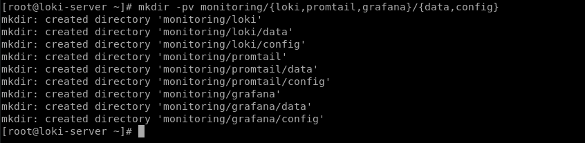

&nbsp;

* We will also leave our provisioning directory created for later use.

```shell
[root@loki-server ~]# mkdir -pv /root/monitoring/grafana/data/provisioning/datasources
```

&nbsp;

* Now let's create our `docker-compose.yaml`. 

```yaml
version: "3"
services:
  loki:
    image: grafana/loki:2.5.0
    volumes:
      - /root/monitoring/loki/config:/mnt/config
    ports:
      - "3100:3100"
    command: -config.file=/mnt/config/loki-config.yaml
    user: loki
    networks:
      - loki

  promtail:
    privileged: true      
    image: grafana/promtail:2.5.0
    volumes:
      - /root/monitoring/promtail/config:/mnt/config
      - /var/log:/var/log
    command: -config.file=/mnt/config/promtail-config.yaml
    ports:
      - "9080:9080"
    user: root
    networks:
      - loki

  grafana:
    image: grafana/grafana:latest
    volumes:
      - grafana-storage:/var/lib/grafana
      - /root/monitoring/grafana/data/provisioning:/etc/grafana/provisioning
    environment:
      - GF_INSTALL_PLUGIN='grafana-simple-json-datasource'
    ports:
      - "3000:3000"
    networks:
      - loki

networks:
  loki:

volumes:
  grafana-storage:
```

&nbsp;


* Now let's create our configuration files, starting with `promtail-config.yaml`.

    * *Promtail is **an agent which ships the contents of local logs to a private Grafana Loki instance**. It is usually deployed to every machine that has applications needed to be monitored.*

```shell
[root@loki-server ~]# cat /root/monitoring/promtail/config/promtail-config.yaml
```
```yaml
server:
  http_listen_port: 9080
  grpc_listen_port: 0

positions:
  filename: /tmp/positions.yaml

clients:
  - url: http://loki-server:3100/loki/api/v1/push

scrape_configs:
- job_name: system
  static_configs:
  - targets:
      - localhost
    labels:
      job: varlogs
      __path__: /var/log/**
```
&nbsp;
Adjust the url according to your scenario, inform the host server followed by the api context for communication.

&nbsp;

> ***Obs.:** In this scenario, promtail is just forwarding logs from the /var/log directory to Loki, which is not a necessary component for receiving logs from Openshift.*


* Now let's create our `loki-config.yaml` file

```shell
[root@loki-server ~]# cat /root/monitoring/loki/config/loki-config.yaml
```
```yaml
auth_enabled: false

server:
  http_listen_port: 3100
  grpc_listen_port: 9096
  grpc_server_max_recv_msg_size: 8388608

common:
  path_prefix: /tmp/loki
  storage:
    filesystem:
      chunks_directory: /tmp/loki/chunks
      rules_directory: /tmp/loki/rules
  replication_factor: 1
  ring:
    instance_addr: 127.0.0.1
    kvstore:
      store: inmemory

schema_config:
  configs:
    - from: 2020-10-24
      store: boltdb-shipper
      object_store: filesystem
      schema: v11
      index:
        prefix: index_
        period: 24h

ingester:
  wal:
    enabled: true
    dir: /tmp/wal
  lifecycler:
    address: 127.0.0.1
    ring:
      kvstore:
        store: inmemory
      replication_factor: 1
    final_sleep: 0s
  chunk_idle_period: 1h       # Any chunk not receiving new logs in this time will be flushed
  chunk_target_size: 8388608
  max_chunk_age: 1h           # All chunks will be flushed when they hit this age, default is 1h
  chunk_retain_period: 30s    # Must be greater than index read cache TTL if using an index cache (Default index read cache TTL is 5m)
  max_transfer_retries: 0     # Chunk transfers disabled

storage_config:
  boltdb_shipper:
    active_index_directory: /tmp/loki/boltdb-shipper-active
    cache_location: /tmp/loki/boltdb-shipper-cache
    cache_ttl: 24h         
    shared_store: filesystem
  filesystem:
    directory: /tmp/loki/chunks

compactor:
  working_directory: /tmp/loki/boltdb-shipper-compactor
  shared_store: filesystem

limits_config:
  reject_old_samples: true
  reject_old_samples_max_age: 12h
  ingestion_rate_mb: 8
  ingestion_burst_size_mb: 16

chunk_store_config:
  max_look_back_period: 0s

table_manager:
  retention_deletes_enabled: false
  retention_period: 0s

ruler:
  storage:
    type: local
    local:
      directory: /tmp/loki/rules
  rule_path: /tmp/loki/rules-temp
  ring:
    kvstore:
      store: inmemory
  enable_api: true  
``` 

> *This configuration can be found in the documentation, in the troubleshooting item, demonstrating the recommendations and best practices, link in the document references.*

&nbsp;


* Now let's start our stack and validate that everything is working correctly

    * Run the command below to start the services

    ```shell
    [root@loki-server ~]# podman-compose --project-name monitoring up -d
    ```

    * To validate that the containers were uploaded correctly, run the following command

    ```shell
    [root@loki-server ~]# podman ps
    ```    
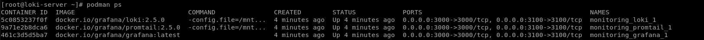    

&nbsp;

* If your result is the same, let's validate if grafana is accessible

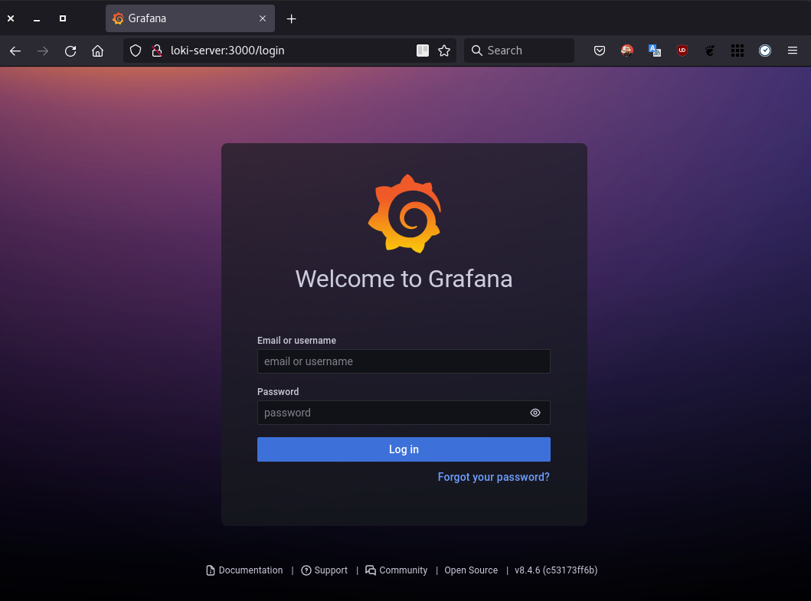 

> *Obs.: To access grafana use the **username** and **password** as `admin`*

&nbsp;

* Now we need to add our datasource pointing to the Loki endpoint and then use the Grafana interface to view our logs.

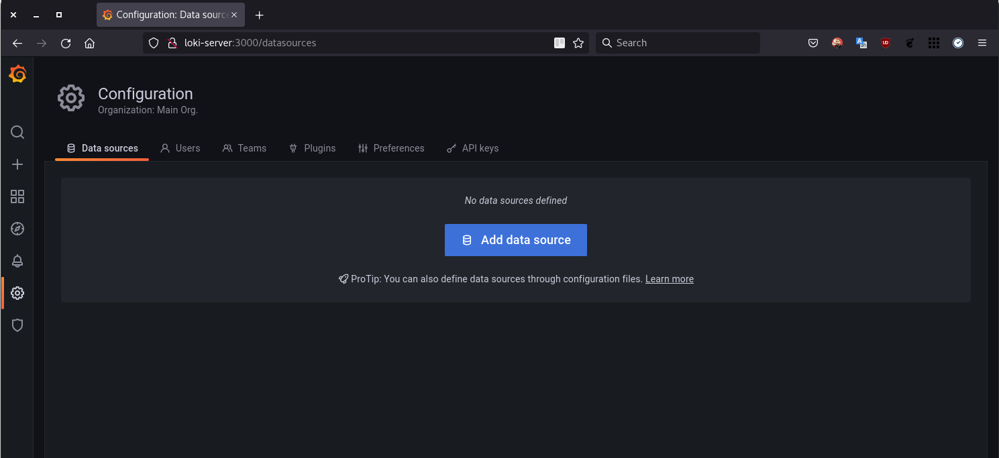 

&nbsp;

* So that we have our datasource being automatically configured as soon as we install our instance, we are going to use the Grafana `PROVISIONING` feature, for that, create the following file:

```shell
[root@loki-server ~]# cat /root/monitoring/grafana/data/provisioning/datasources/loki.yaml
```
```yaml
apiVersion: 1
datasources:
 - name: Loki
   type: loki
   access: proxy
   orgId: 1
   url: http://loki-server:3100
   isDefault: true
   version: 1
   editable: true
```
> This resource will configure a datasource of type `loki`, already pointing to the `url` of the loki server running on port `3100` of my host.

&nbsp;

* After that, run the following command to restart and apply our configuration to datasource

```shell
[root@loki-server ~]# podman pod restart monitoring
```
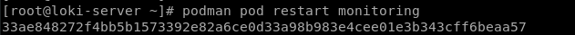 

&nbsp;

* Now we can go back to the Grafana interface and validate that our datasource was created successfully

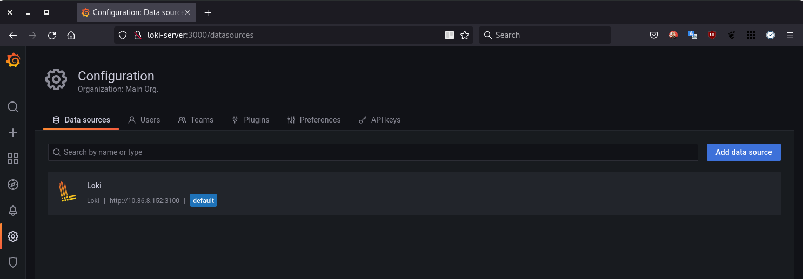 

&nbsp;

* To test our Loki using promtail with local logs, let's create the Explore icon in the side menu, now let's run the following query to validate

```json
{filename="/var/log/messages"}
```

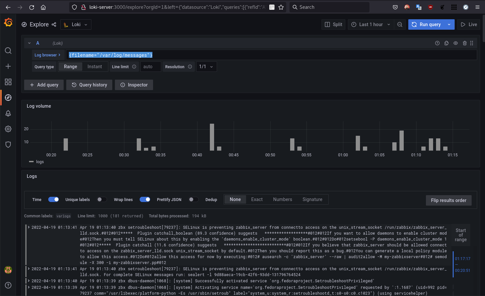 

&nbsp;

Now that we know that our Loki is working properly, let's move on to Openshift.

&nbsp;

## Openshift LogForwarder

&nbsp;

> ***Obs.:** This article does not include the installation of Openshift Logging, for more information, see the reference link.*

&nbsp;

* Now in the Openshift interface

    * In the side menu, select `Installed Operators` > Select the `openshift-logging project` > Then click on "`Cluster Log Forwarder`" in Provided API's.


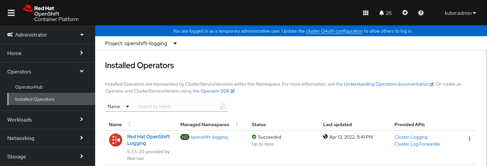

&nbsp;

* Now click on "`Create ClusterLogForwarder`"

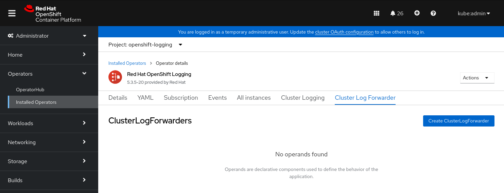

&nbsp;

* In this yaml, we register our loki-server as `remoteloki` and in the `pipeline`, we are informing that we want the `application, infrastructure and audit` logs to be forwarded to `remoteloki` and to the `default`, which in this case is the `internal elasticsearch` of Openshift Logging.

```yaml
apiVersion: logging.openshift.io/v1
kind: ClusterLogForwarder
metadata:
  name: instance
  namespace: openshift-logging
spec:
  outputs:
    - name: remoteloki
      type: loki
      url: 'http://loki-server:3100'
  pipelines:
    - inputRefs:
        - application
        - infrastructure
        - audit
      outputRefs:
        - remoteloki
        - default 
```
&nbsp; 

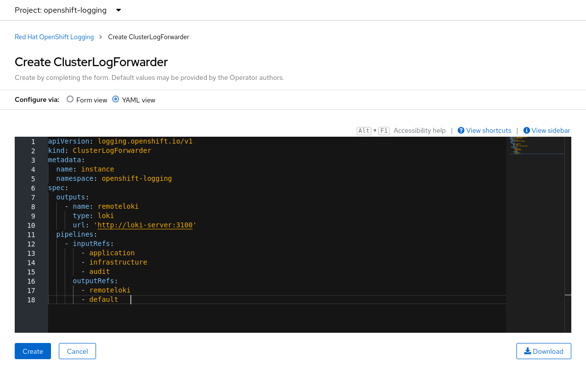

&nbsp;

* After clicking Create, wait until the status is "`Condition: Ready`", as shown in the image below

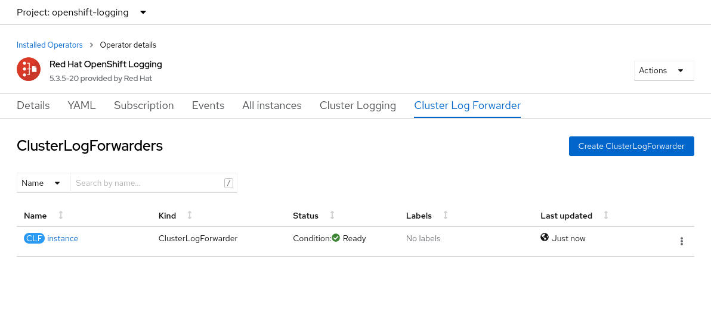


&nbsp;

* After this process, the new configuration needs to be applied to the **collector**(fluentd) pods, wait until all have been restarted and have the new configuration

```shell
[root@bastion ~]# oc get pods -l component=collector -n openshift-logging
```

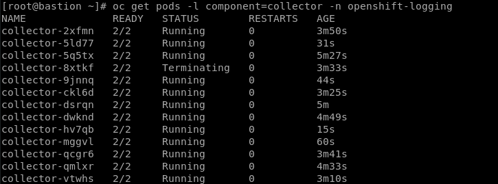

&nbsp;

* Now back in Grafana, we can run the query below to validate that our logs are being successfully received from Openshift

```json
{log_type="application"}
```

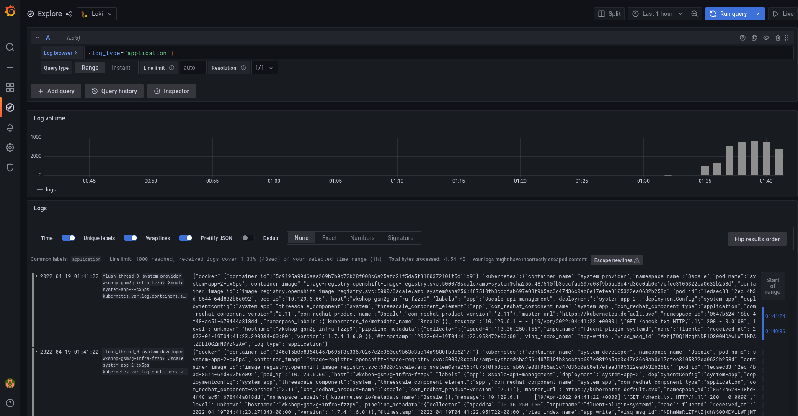

&nbsp;

* For more query and filter options, click the "`Log browser`" button, then select the items you want to query and then "`Show logs`"


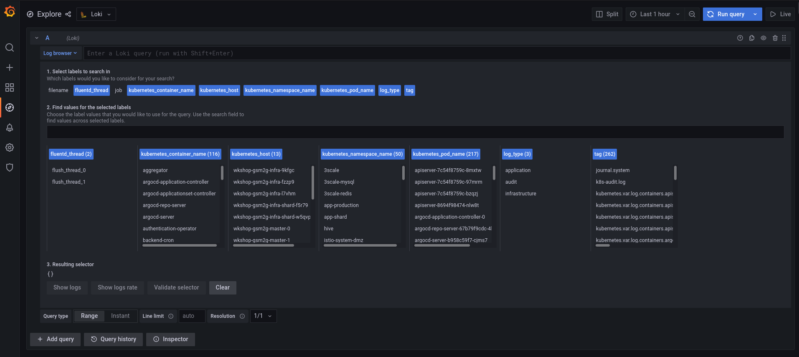

&nbsp;

### Example:

```json
{kubernetes_container_name="argocd-application-controller",kubernetes_host="wkshop-gsm2g-infra-fzzp9",kubernetes_namespace_name="openshift-gitops"}
```

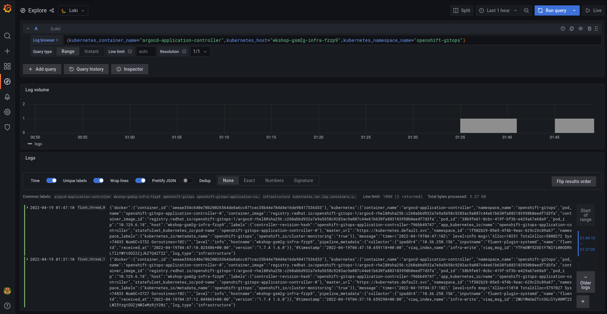

&nbsp;

# References:

[Install Grafana Loki](https://grafana.com/docs/loki/latest/installation/)

[Installing OpenShift Logging ](https://docs.openshift.com/container-platform/4.10/logging/cluster-logging-deploying.html)

[Troubleshooting Loki "entry out of order" errors - Example loki.yaml file](https://docs.openshift.com/container-platform/4.10/logging/cluster-logging-external.html#cluser-logging-troubleshooting-loki-entry-out-of-order-messages_cluster-logging-external)


