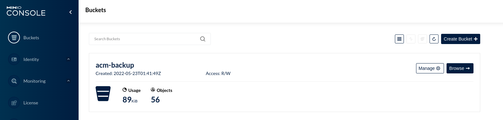
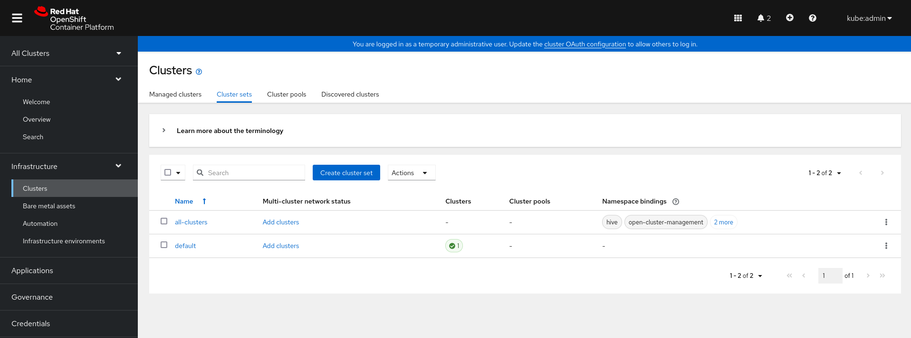
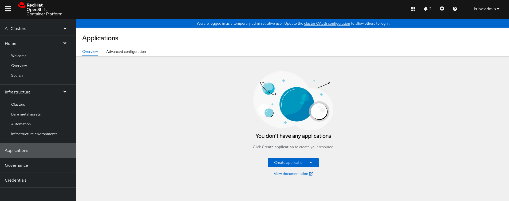
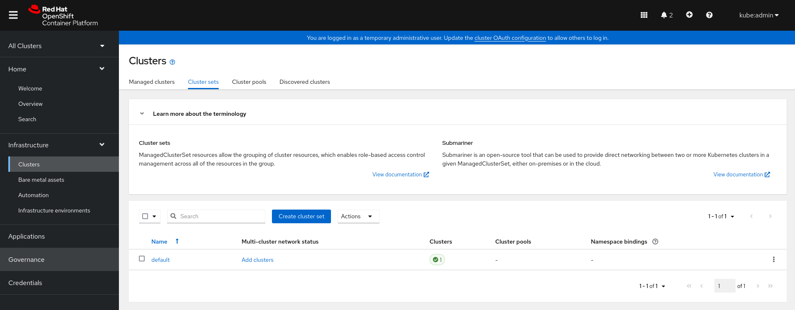
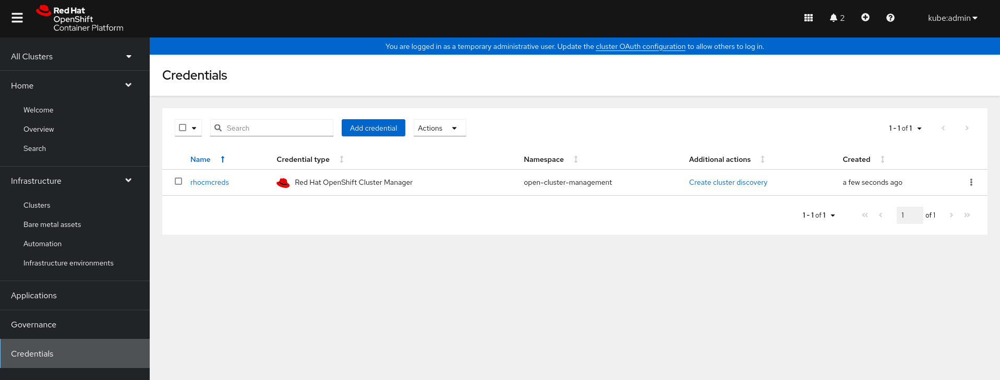
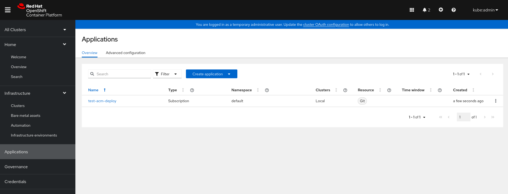
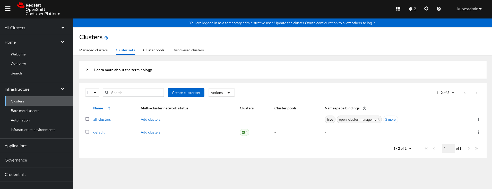
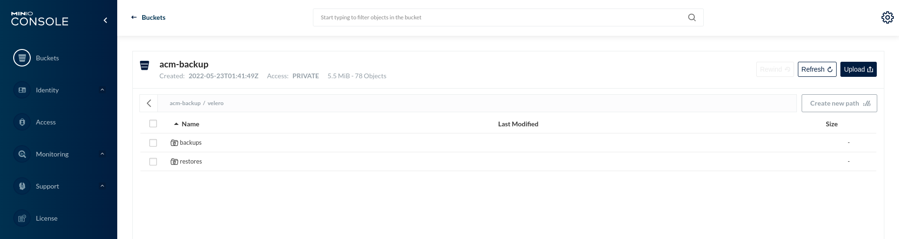
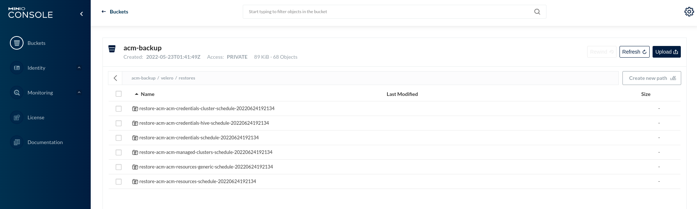

# **How to Backup and Restore ACM with OADP and MinIO**

&nbsp;

> ### This article will demonstrate how to backup and restore Red Hat ACM 2.5 using the OADP solution and the MinIO from the object store..

&nbsp;

First of all, let's understand what are the tools that we will use in this article:


&nbsp;

## **About**

- Red Hat Advanced Cluster Management (**ACM**), offers end-to-end visibility and control for managing your cluster and application lifecycle. Among other features, it ensures security and compliance for your entire Kubernetes domain across multiple data centers and public clouds.

- OpenShift API for Data Protection (**OADP**) enables backup, restore, and disaster recovery of applications on an OpenShift cluster. Data that can be protected with OADP include Kubernetes resource objects, persistent volumes, and internal images.

  - For more details about backup and other features, see this [link¹](#references)

- **MinIO**, is an open source distributed object storage server written in Go, designed for Private Cloud infrastructure providing S3 storage functionality

 

&nbsp;

| :exclamation:  This article will not cover the installation of ACM. |
|------------------------------------------|

&nbsp;

## **Pre-requisites**:


- Red Hat Openshift Container Platform with ACM
- Server rhel 8
    - 8 vcpu
    - 16GB ram
    - 50GB disk of OS
    - 50GB disk of DATA
    - podman


&nbsp;

## **Install MinIO Server**

&nbsp;

- Install podman on server:

```shell
[root@minio-server ~]# dnf install @container-tools -y
```

&nbsp;

- Let's configure our mount point with an LVM volume, we will use the sdb disk as listed below

```shell
[root@minio-server ~]# lsblk
NAME                   MAJ:MIN RM  SIZE RO TYPE MOUNTPOINT
sda                      8:0    0   50G  0 disk 
├─sda1                   8:1    0  600M  0 part /boot/efi
├─sda2                   8:2    0    1G  0 part /boot
└─sda3                   8:3    0 48.4G  0 part 
  ├─rhel_isolated-root 253:0    0 43.4G  0 lvm  /
  └─rhel_isolated-swap 253:1    0    5G  0 lvm  [SWAP]
sdb                      8:16   0   50G  0 disk 
sr0                     11:0    1 1024M  0 rom  
```

&nbsp;

- Let's configure our pv, vg and lv as per the commands listed below

```shell
[root@minio-server ~]# pvcreate /dev/sdb
  Physical volume "/dev/sdb" successfully created.

[root@minio-server ~]# vgcreate vg_minio-data /dev/sdb
  Volume group "vg_minio-data" successfully created

[root@minio-server ~]# lvcreate -n lv_minio-data -l 100%FREE vg_minio-data
  Logical volume "lv_minio-data" created.
```

&nbsp;

- Now let's format our lvm as xfs using the mkfs.xfs command

```shell
[root@minio-server ~]# mkfs.xfs /dev/mapper/vg_minio--data-lv_minio--data
meta-data=/dev/mapper/vg_minio--data-lv_minio--data isize=512    agcount=4, agsize=3276544 blks
         =                       sectsz=512   attr=2, projid32bit=1
         =                       crc=1        finobt=1, sparse=1, rmapbt=0
         =                       reflink=1
data     =                       bsize=4096   blocks=13106176, imaxpct=25
         =                       sunit=0      swidth=0 blks
naming   =version 2              bsize=4096   ascii-ci=0, ftype=1
log      =internal log           bsize=4096   blocks=6399, version=2
         =                       sectsz=512   sunit=0 blks, lazy-count=1
realtime =none                   extsz=4096   blocks=0, rtextents=0
```

&nbsp;

- Now let's create the directory that we will use to make our mount point

```shell
[root@minio-server ~]# mkdir -pv /minio/data
mkdir: created directory '/minio'
mkdir: created directory '/minio/data'
```

&nbsp;

- Before performing the mount, let's adjust the contexts of this directory, using the restorecon command, run the command below

```shell
[root@minio-server ~]# restorecon -RFvv /minio
Relabeled /minio from unconfined_u:object_r:default_t:s0 to system_u:object_r:default_t:s0
Relabeled /minio/data from system_u:object_r:unlabeled_t:s0 to system_u:object_r:default_t:s0
```

&nbsp;

- Let's also install tuned and apply a configuration profile to improve our performance.

```shell
[root@minio-server ~]# dnf install tuned.noarch tuned-utils.noarch tuned-utils-systemtap.noarch -y
```

&nbsp;

- To list available profiles, run this command

```shell
[root@minio-server ~]# tuned-adm list
Available profiles:
- accelerator-performance     - Throughput performance based tuning with disabled higher latency STOP states
- balanced                    - General non-specialized tuned profile
- desktop                     - Optimize for the desktop use-case
- hpc-compute                 - Optimize for HPC compute workloads
- intel-sst                   - Configure for Intel Speed Select Base Frequency
- latency-performance         - Optimize for deterministic performance at the cost of increased power consumption
- network-latency             - Optimize for deterministic performance at the cost of increased power consumption, focused on low latency network performance
- network-throughput          - Optimize for streaming network throughput, generally only necessary on older CPUs or 40G+ networks
- optimize-serial-console     - Optimize for serial console use.
- powersave                   - Optimize for low power consumption
- throughput-performance      - Broadly applicable tuning that provides excellent performance across a variety of common server workloads
- virtual-guest               - Optimize for running inside a virtual guest
- virtual-host                - Optimize for running KVM guests
Current active profile: balanced
```

&nbsp;

- Let's define the throughput-performance profile, with the command below

```shell
[root@minio-server ~]# tuned-adm profile throughput-performance

[root@minio-server ~]# tuned-adm active
Current active profile: throughput-performance
```

&nbsp;

- Now let's mount our /minio/data directory, for that, add the line below in your /etc/fstab

```shell
[root@minio-server ~]# tail -n2 /etc/fstab 
# MINIO DATA
/dev/mapper/vg_minio--data-lv_minio--data /minio/data xfs defaults,noatime,nodiratime 1 2
```

&nbsp;

- Now to mount, run the command below

```shell
[root@minio-server ~]# mount -v /minio/data
mount: /dev/mapper/vg_minio--data-lv_minio--data mounted on /minio/data.
```

&nbsp;

- Now let's create the mini user and define its home

```shell
[root@minio-server ~]# useradd -s /sbin/nologin -d /minio minio
[root@minio-server ~]# chown -R minio:minio /minio
```

&nbsp;

- Now, let's run our MinIO Container

```shell
podman run \
  --detach \
  -p 9000:9000 \                           <---- MinIO API Port
  -p 9001:9001 \                           <---- MinIO Console Port
  --user $(id -u minio):$(id -g minio) \   
  --name minio-server \
  -e "MINIO_ROOT_USER=miniouseradmin" \    <---- MinIO User API & Console
  -e "MINIO_ROOT_PASSWORD=miniouserpass" \ <---- MinIO Pass API & Console
  -v /minio/data:/data:z \                 <---- Data Volume Mount
  quay.io/minio/minio server /data --console-address ":9001"
```
&nbsp;

| :warning:  Change the value of `minio_root_user` and `minio_root_password`.  |
|-----------------------------------------|

&nbsp;

- Now we can visualize our minio running by running the command below

```shell
[root@minio-server ~]# podman ps
CONTAINER ID  IMAGE                       COMMAND               CREATED         STATUS             PORTS                             NAMES
d69929bc4701  quay.io/minio/minio:latest  server /data --co...  11 seconds ago  Up 11 seconds ago  0.0.0.0:9000-9001->9000-9001/tcp  minio-server
```

&nbsp;

- Now, to configure our container as a service managed by systemd, let's do the following, create the following directory structure:

```shell
[root@minio-server ~]# mkdir -pv .config/systemd/user
mkdir: created directory '.config'
mkdir: created directory '.config/systemd'
mkdir: created directory '.config/systemd/user'

[root@minio-server ~]# cd ~/.config/systemd/user/
```

&nbsp;

- With the command below, our file service will be generated, to control the start, stop, restart and status of our container

```shell
[root@minio-server user]# podman generate systemd --name minio-server --files --new 
/root/.config/systemd/user/container-minio-server.service

[root@minio-server user]# systemctl --user daemon-reload
```

&nbsp;

- Now let's enable our service so that it can start along with the OS and validate the status of our service

```shell
[root@minio-server user]# systemctl --user enable container-minio-server.service 
Created symlink /root/.config/systemd/user/multi-user.target.wants/container-minio-server.service → /root/.config/systemd/user/container-minio-server.service.
Unit /root/.config/systemd/user/container-minio-server.service is added as a dependency to a non-existent unit multi-user.target.
Created symlink /root/.config/systemd/user/default.target.wants/container-minio-server.service → /root/.config/systemd/user/container-minio-server.service.


[root@minio-server user]# systemctl --user status container-minio-server.service 
● container-minio-server.service - Podman container-minio-server.service
   Loaded: loaded (/root/.config/systemd/user/container-minio-server.service; enabled; vendor preset: enabled)
   Active: active (running) since Thu 2022-05-05 17:23:20 -03; 15s ago
     Docs: man:podman-generate-systemd(1)
  Process: 31407 ExecStartPre=/bin/rm -f /run/user/0/container-minio-server.service.ctr-id (code=exited, status=0/SUCCESS)
 Main PID: 31532 (conmon)
    Tasks: 2 (limit: 101098)
   Memory: 2.2M
   CGroup: /user.slice/user-0.slice/user@0.service/container-minio-server.service
           └─31532 /usr/bin/conmon --api-version 1 -c b9e648d667dd599898f70e4eb6ad280e7a81c9bd06885841a88c9c890ca08491 -u b9e648d667dd599898f70e4eb6ad280e7a81c9bd06885841a88c9c890ca08491 -r /usr/bin/runc -b /va>
May 05 17:23:19 minio-server systemd[4546]: Starting Podman container-minio-server.service...
May 05 17:23:20 minio-server podman[31409]: d69929bc470164c82bc802069f7d1f31c3023bcdf48c9bdabbc1c4a1cb8d9f4f
May 05 17:23:20 minio-server systemd[4546]: Started Podman container-minio-server.service.
May 05 17:23:20 minio-server podman[31409]: b9e648d667dd599898f70e4eb6ad280e7a81c9bd06885841a88c9c890ca08491
```

&nbsp;

- Now let's adjust the firewalld and authorize access through our ports `9000` and `9001`, for that follow the commands below

```shell
[root@minio-server user]# firewall-cmd --state
running
[root@minio-server user]# firewall-cmd --get-default-zone
public
[root@minio-server user]# firewall-cmd --zone=public --add-port=9000-9001/tcp --permanent
success
[root@minio-server user]# firewall-cmd --reload
success
```

&nbsp;

- Access the server ip on port 9001 (console), to authenticate, use the user and pass defined in the execution of the container


&nbsp;

- After accessing the console, on the left side menu, click on Buckets and then on the `Create Bucket` button, set the name and click on `Create Bucket` again.


&nbsp;

- After creating our bucket, we go to Openshift to install the OADP.


&nbsp;

## **Configuring Openshift Advanced Cluster Management and OADP**

&nbsp;


Now that we have our OADP installed and configured, let's configure our ACM.

- In the `multiclusterhub` we need to enable the backup, for that, let's run the command below, to modify the component `cluster-backup` to `enabled: true`

```shell
[root@bastion OADP]# oc project open-cluster-management

[root@bastion OADP]# oc get multiclusterhub multiclusterhub -o yaml | grep "cluster-backup" -B1
    - enabled: false
      name: cluster-backup

[root@bastion OADP]# oc patch MultiClusterHub multiclusterhub \
> -n open-cluster-management --type=json \
> -p='[{"op": "add", "path": "/spec/overrides/components/-","value":{"name":"cluster-backup","enabled":true}}]'
multiclusterhub.operator.open-cluster-management.io/multiclusterhub patched

[root@bastion OADP]# oc get multiclusterhub multiclusterhub -o yaml | grep "cluster-backup" -B1
    - enabled: true
      name: cluster-backup
```

- After we enable the cluster-backup parameter, we can see that a component called `cluster-backup-chart-sub` appears as Installed successfully.

  - This component has just installed the operator `OADP` in the `open-cluster-management-backup namespace`, maximizing configuration steps.

```shell
[root@bastion OADP]# oc get multiclusterhub multiclusterhub -o yaml | grep "cluster-backup-chart-sub" -A4 -B2
status:
  components:
    cluster-backup-chart-sub:
      lastTransitionTime: "2022-06-23T19:10:23Z"
      reason: InstallSuccessful
      status: "True"
      type: Deployed
```


- Now let's create our credential secret, informing our MinIO username and password

```shell
cat <<EOF > credentials
[default]
aws_access_key_id=miniouseradmin
aws_secret_access_key=miniouserpass
EOF

[root@bastion OADP]# cat credentials
[default]
aws_access_key_id=miniouseradmin
aws_secret_access_key=miniouserpass
```

&nbsp;

- To create the secret, run the command below, remembering that the name of the secret must be cloud-credentials

```shell
[root@bastion OADP]# oc create secret generic cloud-credentials -n open-cluster-management-backup --from-file cloud=credentials
secret/cloud-credentials created

[root@bastion OADP]# oc -n open-cluster-management-backup extract secret/cloud-credentials --to=-
# cloud
[default]
aws_access_key_id=miniouseradmin
aws_secret_access_key=miniouserpass
```

&nbsp;

| :warning:  For greater security, create a dedicated user for this action through the MinIO console.  |
|-----------------------------------------|
  
&nbsp;

- Let's create now, our `DataProtectionApplication` instance, for that, run the following command

```yaml
cat <<EOF > oadp-instance.yaml
apiVersion: oadp.openshift.io/v1alpha1
kind: DataProtectionApplication
metadata:
  name: oadp-minio
  namespace: open-cluster-management-backup
spec:
  backupLocations:
    - velero:
        config:
          profile: default
          region: minio
          s3ForcePathStyle: 'true'
          s3Url: 'http://10.36.8.155:9000'
        credential:
          key: cloud
          name: cloud-credentials
        default: true
        objectStorage:
          bucket: acm-backup
          prefix: velero
        provider: aws
  configuration:
    restic:
      enable: true
    velero:
      defaultPlugins:
        - openshift
        - aws
        - kubevirt
  snapshotLocations:
    - velero:
        config:
          profile: default
          region: minio
        provider: aws
EOF
```

```shell
[root@bastion OADP]# oc -n open-cluster-management-backup create -f oadp-instance.yaml 
dataprotectionapplication.oadp.openshift.io/oadp-minio created

[root@bastion OADP]# oc -n open-cluster-management-backup get DataProtectionApplication oadp-minio
NAME         AGE
oadp-minio   12s
```


&nbsp;

- Now let's create our `BackupSchedule`

```yaml
cat <<EOF > backup-schedule-acm.yaml
apiVersion: cluster.open-cluster-management.io/v1beta1
kind: BackupSchedule
metadata:
  name: schedule-acm
spec:
  maxBackups: 3                 # Maximum number of backups after which old backups should be removed
  veleroSchedule: 0 */6 * * *   # Create a backup every 6 hours
  veleroTtl: 72h                # Deletes scheduled backups after 72h
EOF
```

```shell
[root@bastion OADP]# oc -n open-cluster-management-backup create -f backup-schedule-acm.yaml
backupschedule.cluster.open-cluster-management.io/schedule-acm created

[root@bastion OADP]# oc get BackupSchedule -n open-cluster-management-backup
NAME           PHASE     MESSAGE
schedule-acm   Enabled   Velero schedules are enabled
```

&nbsp;

- Once we create our `BackupSchedule`, the following Schedules will automatically be created: `acm-credentials`, `acm-managed-clusters` and `acm-resources`

```shell
[root@bastion OADP]# oc get Schedule -n open-cluster-management-backup
NAME                               AGE
acm-credentials-cluster-schedule   113s
acm-credentials-hive-schedule      113s
acm-credentials-schedule           114s
acm-managed-clusters-schedule      113s
acm-resources-generic-schedule     113s
acm-resources-schedule             113s
acm-validation-policy-schedule     113s

```

&nbsp;

### Description of each schedule:

- **Credentials Backup**
    - This backup schedule contains three backup files for Hive, Red Hat Advanced Cluster Management, and user-created credentials. 
- **Managed Clusters Backup**
    - This schedule contains only resources that activate the managed cluster connection to the hub cluster, where the backup is restored.                        
- **Resources Backup**
    - This backup schedule contains one backup for the Red Hat Advanced Cluster Management resources and one for generic resources. These resources use the following label, `cluster.open-cluster-management.io/backup`. 

&nbsp;

- After a few minutes, we already have our first Backup successfully performed.

```shell
[root@bastion OADP]# oc get Backup -n open-cluster-management-backup
NAME                                              AGE
acm-credentials-cluster-schedule-20220624192134   12m
acm-credentials-hive-schedule-20220624192134      12m
acm-credentials-schedule-20220624192134           12m
acm-managed-clusters-schedule-20220624192134      12m
acm-resources-generic-schedule-20220624192134     12m
acm-resources-schedule-20220624192134             12m
acm-validation-policy-schedule-20220624192134     12m
```

&nbsp;

- We can also view our backup data directly from the MinIO console



&nbsp;

- By clicking on the Browse button, we can browse the created directories and files.


&nbsp;

## **Data loss simulation**

&nbsp;

- Now let's simulate the removal of some objects: Credentials, ClusterSet and Application, after deleting these objects, let's restore using our most recent backup.
Let's delete the following objects:

    - **Credentials**: *rhocmcreds*
    - **Applications**: *teste-acm-deploy*
    - **ClusterSet:** *clusters-rhocm*

&nbsp;

- **Before:**




&nbsp;

- **After:**





&nbsp;

## **Restore Objects**

First, let's understand the possible options for filling in the fields below

- **veleroManagedClustersBackupName**
    - latest &emsp;&emsp;&emsp;&emsp;&emsp; *<----- Restore the most recent Backup*
    - skip &emsp;&emsp;&emsp;&emsp;&emsp;&emsp;*<----- Ignore the job, taking no action*
    - backup_name&emsp;&emsp;*<----- Restore the specific backup name*
 
- **veleroCredentialsBackupName**
    - latest
    - skip
    - specific backup name

- **veleroResourcesBackupName**
    - latest
    - skip
    - specific backup name

&nbsp;

- Let's now recover the deleted objects, for that we will perform the steps below

```yaml
cat <<EOF > acm-cluster-restore.yaml
apiVersion: cluster.open-cluster-management.io/v1beta1
kind: Restore
metadata:
  name: restore-acm
spec:
  cleanupBeforeRestore: CleanupRestored       <---- Clean up only resources created by a previous acm restore
  veleroManagedClustersBackupName: latest     <---- Restore our latest acm-managed-clusters-schedule
  veleroCredentialsBackupName: latest         <---- Restore our latest acm-credentials-schedule 
  veleroResourcesBackupName: latest           <---- Restore our latest acm-resources-schedule 
EOF
```

```shell
[root@bastion OADP]# oc create -f acm-cluster-restore.yaml
```

&nbsp;

- After creating and applying the restore yaml, let's run the commands below to view our restore job:

```shell
[root@bastion OADP]# oc get restores -n open-cluster-management-backup
NAME          PHASE     MESSAGE
restore-acm   Started   Prepare to restore, cleaning up resources


[root@bastion OADP]# oc get restores.velero.io -n open-cluster-management-backup
NAME                                                       AGE
restore-acm-acm-credentials-cluster-schedule-20220624192134   2m36s
restore-acm-acm-credentials-hive-schedule-20220624192134      2m36s
restore-acm-acm-credentials-schedule-20220624192134           2m36s
restore-acm-acm-managed-clusters-schedule-20220624192134      2m36s
restore-acm-acm-resources-generic-schedule-20220624192134     2m36s
restore-acm-acm-resources-schedule-20220624192134             2m36s


```

&nbsp;

- Follow through the command below, until the message is like the example below

```shell
[root@bastion OADP]# oc get restores -n open-cluster-management-backup
NAME          PHASE                MESSAGE
restore-acm   FinishedWithErrors   Velero restores have run to completion but encountered 1+ errors
```

&nbsp;

In this example, our restore was executed with failure, because with all backup resources created, there is no cluster, such as acm-credentials-cluster-schedule

&nbsp;

- To view the restore jobs that have failed or partially failed status, we will execute the commands below
```shell
# To list all restore jobs

[root@bastion OADP]# oc -n open-cluster-management-backup exec $(oc get pod -l app.kubernetes.io/instance=oadp-minio -o name) -c velero -- ./velero restore get
NAME                                                          BACKUP                                            STATUS            STARTED                         COMPLETED                       ERRORS   WARNINGS   CREATED                         SELECTOR
restore-acm-acm-credentials-cluster-schedule-20220624192134   acm-credentials-cluster-schedule-20220624192134   PartiallyFailed   2022-06-24 20:16:48 +0000 UTC   2022-06-24 20:16:49 +0000 UTC   1        0          2022-06-24 20:16:44 +0000 UTC   <none>
restore-acm-acm-credentials-hive-schedule-20220624192134      acm-credentials-hive-schedule-20220624192134      PartiallyFailed   2022-06-24 20:16:47 +0000 UTC   2022-06-24 20:16:48 +0000 UTC   1        0          2022-06-24 20:16:44 +0000 UTC   <none>
restore-acm-acm-credentials-schedule-20220624192134           acm-credentials-schedule-20220624192134           Completed         2022-06-24 20:16:44 +0000 UTC   2022-06-24 20:16:45 +0000 UTC   0        0          2022-06-24 20:16:44 +0000 UTC   <none>
restore-acm-acm-managed-clusters-schedule-20220624192134      acm-managed-clusters-schedule-20220624192134      PartiallyFailed   2022-06-24 20:16:47 +0000 UTC   2022-06-24 20:16:47 +0000 UTC   1        0          2022-06-24 20:16:44 +0000 UTC   <none>
restore-acm-acm-resources-generic-schedule-20220624192134     acm-resources-generic-schedule-20220624192134     PartiallyFailed   2022-06-24 20:16:45 +0000 UTC   2022-06-24 20:16:45 +0000 UTC   1        0          2022-06-24 20:16:44 +0000 UTC   <none>
restore-acm-acm-resources-schedule-20220624192134             acm-resources-schedule-20220624192134             Completed         2022-06-24 20:16:45 +0000 UTC   2022-06-24 20:16:47 +0000 UTC   0        0          2022-06-24 20:16:44 +0000 UTC   <none>


# To see logs of restore job

[root@bastion OADP]# oc -n open-cluster-management-backup exec $(oc get pod -l app.kubernetes.io/instance=oadp-minio -o name) -c velero -- ./velero restore logs restore-acm-acm-credentials-cluster-schedule-20220624192134
time="2022-06-24T20:16:48Z" level=info msg="starting restore" logSource="pkg/controller/restore_controller.go:465" restore=open-cluster-management-backup/restore-acm-acm-credentials-cluster-schedule-20220624192134
time="2022-06-24T20:16:48Z" level=info msg="Starting restore of backup open-cluster-management-backup/acm-credentials-cluster-schedule-20220624192134" logSource="pkg/restore/restore.go:387" restore=open-cluster-management-backup/restore-acm-acm-credentials-cluster-schedule-20220624192134
time="2022-06-24T20:16:48Z" level=info msg="restore completed" logSource="pkg/controller/restore_controller.go:480" restore=open-cluster-management-backup/restore-acm-acm-credentials-cluster-schedule-20220624192134

# To visualize description of restore job

[root@bastion managedcluster]# oc -n open-cluster-management-backup exec $(oc get pod -l app.kubernetes.io/instance=oadp-minio -o name) -c velero -- ./velero restore describe restore-acm-acm-credentials-cluster-schedule-20220624192134
Name:         restore-acm-acm-credentials-cluster-schedule-20220624192134
Namespace:    open-cluster-management-backup
Labels:       <none>
Annotations:  <none>

Phase:  PartiallyFailed (run 'velero restore logs restore-acm-acm-credentials-cluster-schedule-20220624192134' for more information)

Started:    2022-06-24 20:16:48 +0000 UTC
Completed:  2022-06-24 20:16:49 +0000 UTC

Errors:
  Velero:   error parsing backup contents: directory "resources" does not exist
  Cluster:    <none>
  Namespaces: <none>

Backup:  acm-credentials-cluster-schedule-20220624192134

Namespaces:
  Included:  all namespaces found in the backup
  Excluded:  <none>

Resources:
  Included:        *
  Excluded:        nodes, events, events.events.k8s.io, backups.velero.io, restores.velero.io, resticrepositories.velero.io
  Cluster-scoped:  auto

Namespace mappings:  <none>

Label selector:  <none>

Restore PVs:  auto

Preserve Service NodePorts:  auto
```

This way we can troubleshoot our restore job


&nbsp;

- We can check that the restore worked correctly by viewing the creation time in Credentials and Applications





&nbsp;

- After performing the restore successfully, we can see in MinIO that a new directory has been created and inside we have the backups that were used in the restore.




&nbsp;
&nbsp;


## **References**


- [Cluster backup and restore operator](https://access.redhat.com/documentation/en-us/red_hat_advanced_cluster_management_for_kubernetes/2.5/html/clusters/managing-your-clusters#hub-backup-and-restore)
- [Cluster Back up and Restore Operator](https://github.com/stolostron/cluster-backup-operator)
- [Installing the OADP Operator](https://docs.openshift.com/container-platform/4.10/backup_and_restore/application_backup_and_restore/installing/installing-oadp-aws.html#oadp-installing-operator_installing-oadp-aws)
- [MinIO Quickstart Guide](https://docs.min.io/docs/minio-quickstart-guide.html)
- [Backup and Restore Hub Clusters with Red Hat Advanced Cluster Management for Kubernetes](https://cloud.redhat.com/blog/backup-and-restore-hub-clusters-with-red-hat-advanced-cluster-management-for-kubernetes)¹