# **How To Monitor Openshift Virtualization VMs with Zabbix**

&nbsp;

> ### In this article, I will demonstrate how to use Zabbix integrated with Prometheus/Thanos in the Openshift Virtualization Cluster. We will use LLD (Low Level Discovery) to automate the discovery of all VMs and thus be able to monitor CPU, Memory, Network, etc..
>
> In this article we use the following versions:
> - Openshift v4.18.23
> - Kubernetes v1.31.11
> - Zabbix 6.0.43


&nbsp;

> [!IMPORTANT]
> Installation of the Zabbix will not be covered.


&nbsp;
&nbsp;


## **About**

- This article is aimed at users who need to create and monitor their **Openshift Virtualization** using **Zabbix**, creating capacity alerts, applications, etc.

- We will use **Zabbix** to connect to the **Prometheus/Thanos API** and have access to all metrics available in the environment, such as kubevirt metrics and infrastructure.

- We will create a template using the `LLD` (Low Level Discovery) resource, which will process the collection of metrics that we will define and create the items and triggers.


## **Prerequisites**

- User with the cluster-admin cluster role
- Openshift 4.16 or +
- Zabbix Server

&nbsp;
&nbsp;

## **Procedure**

&nbsp;

### Openshift

&nbsp;

#### Creating a ServiceAccount

- In Openshift, let's create a ServiceAccount to use in our Zabbix connection to Prometheus/Thanos.
- Using the oc cli, connect to Openshift and follow the steps below.

```shell
$ oc project openshift-monitoring
$ oc create sa zabbix-sa
$ oc adm policy add-cluster-role-to-user cluster-monitoring-view -z zabbix-sa
```

&nbsp;

- Now let's create a token to perform our authentication

```shell
$ oc create token zabbix-sa -n openshift-monitoring --duration=8760h
```

> [!NOTE]
>  Using this command, we will have a token valid for 1 year; after this period, it is necessary to create a new one.

&nbsp;

- To create a token without expiration, create a secret of type `service-account-token`

```yaml
$ cat <<EOF | oc apply -f -
apiVersion: v1
kind: Secret
metadata:
  name: zabbix-token                                # <----- Secret Name
  namespace: openshift-monitoring
  annotations:
    kubernetes.io/service-account.name: zabbix-sa   # <----- ServiceAccount Name
type: kubernetes.io/service-account-token           
EOF

```

- Now, to display the token, run the command below and save it for use in Zabbix

```shell
$ oc -n openshift-monitoring get secret zabbix-token -o jsonpath='{.data.token}' | base64 -d
```

- Collect Thanos Endpoint
```shell
$ oc -n openshift-monitoring get route thanos-querier -o jsonpath='{.spec.host}'
```

&nbsp;
&nbsp;

### Zabbix

&nbsp;

#### Create Host Group

- Let's create a Host Group to organize and create our openshift hosts to monitor.

- To do this, in the left side menu, click on `Configuration` > `Host groups` > `Create host group` > define the `Group name` and click `Add`

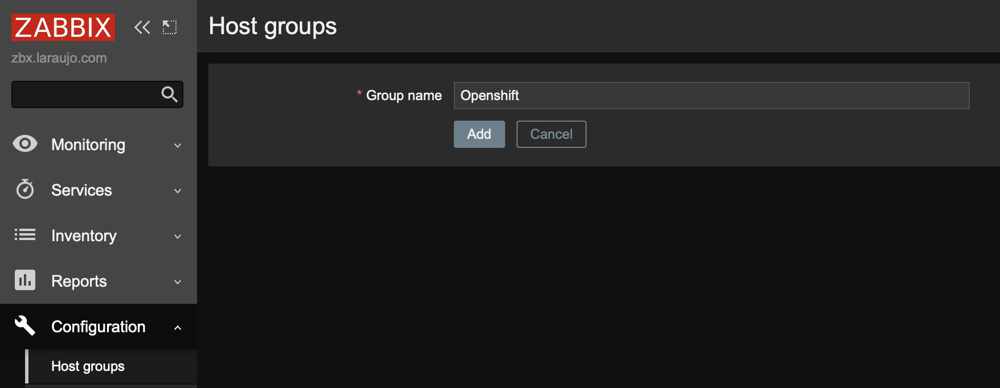

&nbsp;

#### Create Template

- Now we'll create a template to centralize all the items we want to monitor in OpenShift Virtualization so we can reuse it in other clusters.

- In the left side menu, click on `Configuration` > `Templates` > `Create template` > define the `Template name` > in `Groups` enter the Host Group name created previously, then click on `ADD`.

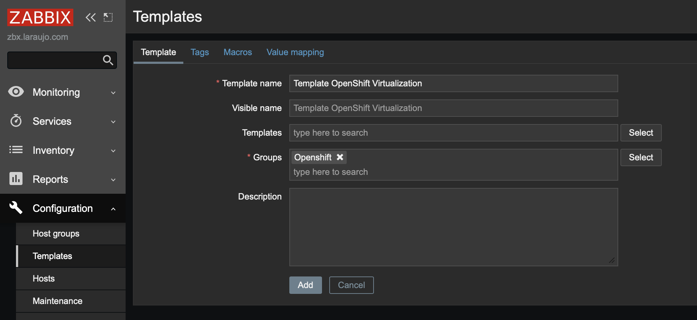

&nbsp;

#### Create Host

- Now we will create a host, which will be the identifier for our OpenShift Cluster. This will allow us to monitor more than one host (OpenShift cluster) with the same template.

- In the left side menu, click on `Configuration` > `Hosts` > `Create host`, then define the following fields: 
    - `Host name `:  _Name that will help identify the cluster to be monitored_
    - `Templates`:  _Select the template we just created_
    - `Groups`:  _Select the Group Host we just created_
    - `Description`: _Add relevant information about the cluster (Optional)_

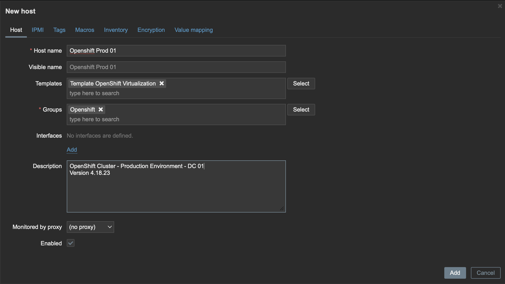

- Before saving, click on Macros and let's add two variables (macros), which we will associate with our host (cluster) and use in our data collection.

- Create the following Macros:
    - `{$PROM_URL}`:  _Add the Thanos URL that we collected in the last step of the serviceaccount._
    - `{$PROM_TOKEN}`: _Add the token we created for our serviceaccount._

- Now we can click `Add` and save our host.

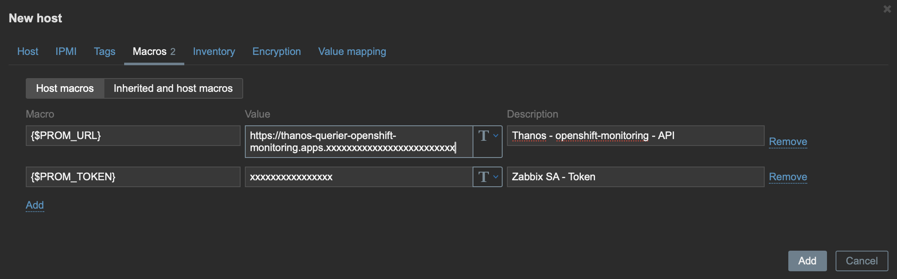


&nbsp;
&nbsp;


### LLD - Low Level Discovery

&nbsp;

`Low-Level Discovery (LLD)` in Zabbix is a feature that automatically discovers resources within a monitored system and dynamically creates monitoring items, triggers, and graphs based on predefined rules.

Knowing the function of LLD, let's create 2 LLDs, one for **Virtual Machines** and another for **Virtualization Nodes** in Openshift.

&nbsp;

#### Create Discovery Rule (LLD) for Virtual Machines

- We will create a `Discovery Rule (LLD)` that will discover all the Virtual Machines created in our OpenShift Virtualization cluster.

- In the left side menu, click on `Configuration` > `Templates` > click on the template we created earlier > click on `Discovery rules` in the top tab > then click on `Create discovery rule`.

- We will fill in the following fields:
    - Name: _Add the name of the discovery that will be made_
    - Type: _Select `HTTP agent`_
    - Key: _Define a unique identifier for this execution_
    - URL: _This will be our endpoint for querying metrics using the Macro `{$PROM_URL}/api/v1/query`_
    - Query fields: _This field is responsible for passing our query promql to the endpoint in the URL field._
        - Name: _`query`_
        - Value: _`kubevirt_vm_info`_
    - Headers: _Here we will add our token for authentication to the API using our Token Macro._
        - Name: _`Authorization`_
        - Value: _`Bearer {$PROM_TOKEN}`_
    - Update interval: _`1h`, this is the frequency at which our VM discovery will be run, to discover new VMs._    

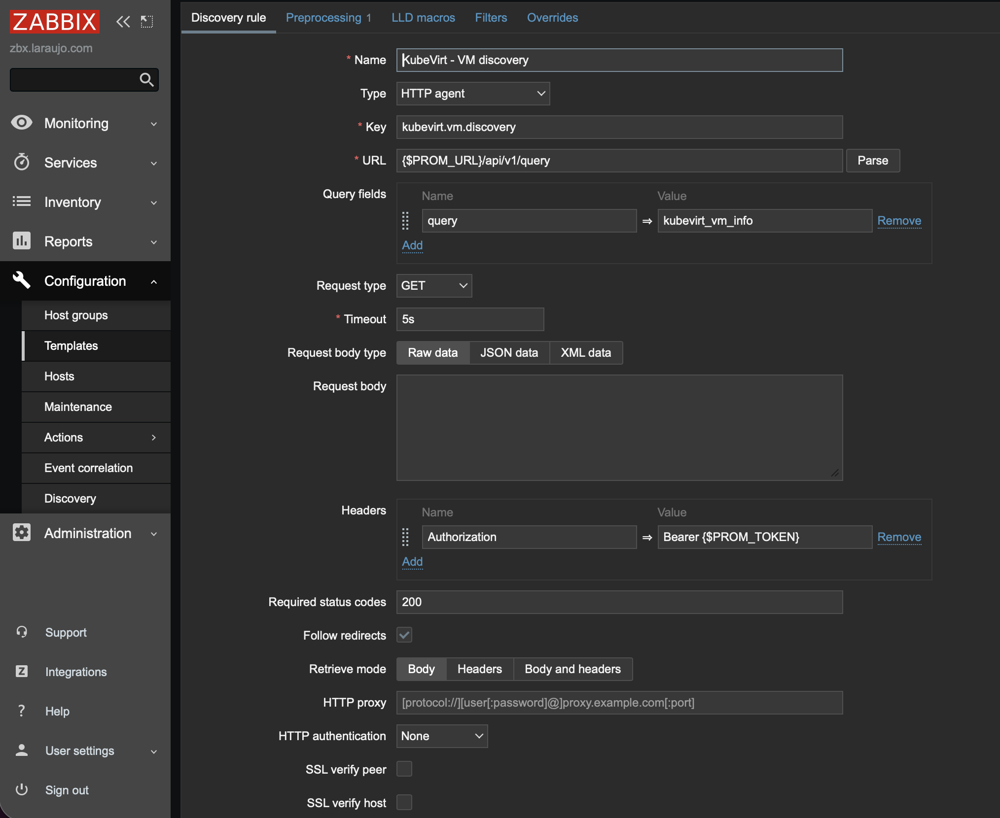

&nbsp;

- Our query will return a JSON output, but we need to filter the content we want in this output, to do this, we will use the `Preprocessing` feature.

- Click on `Preprocessing` > `Add` > In Name, select `Javascript` > click on `Parameters` and add the script below:

```javascript
var obj = JSON.parse(value);
var out = [];

for (var i = 0; i < obj.data.result.length; i++) {
  var m = obj.data.result[i].metric;
  out.push({
    "{#VM}": m.name,
    "{#NAMESPACE}": m.namespace
  });
}

return JSON.stringify({ "data": out });
```

> [!NOTE]
> _This script will process all the output and filter only the following information: VM name and Namespace, already creating Macros (variables) for later use._

&nbsp;

- To validate that our `Preprocessing` is working correctly, click `Test all steps`
- Check the `Get value from host` box and add the `Macros` values, adding the thanos endpoint and the bearer token, then click `Get value and test`

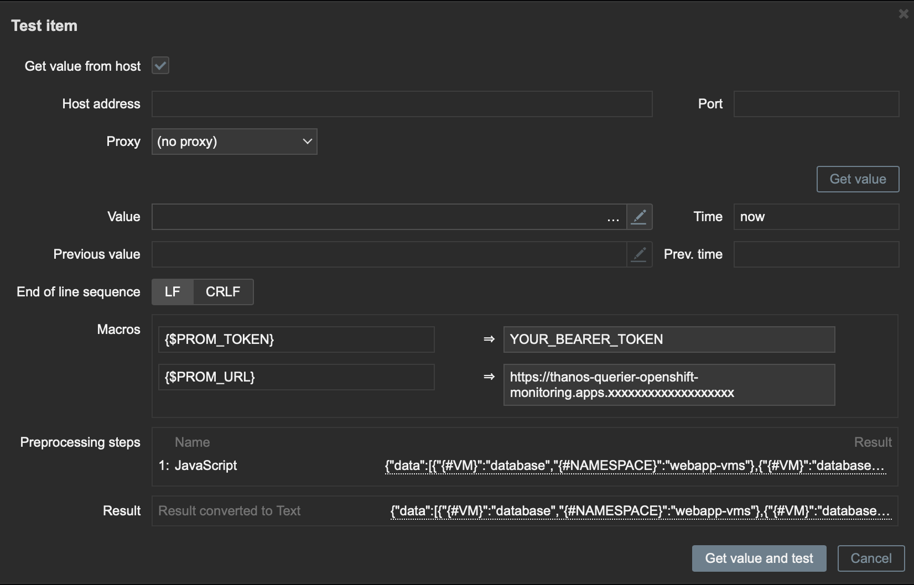

> [!NOTE]
> With this test, we can see that our script is working correctly.

- Click `Add` to save our Preprocessing and click `Add` again to save our Discovery Rule.

&nbsp;

#### Create Item Prototype

- With the `Item Prototype`, we will create specific queries such as CPU, Memory, Network, Uptime, and Phase using the discovery rule's Macros (variables), **VM** and **NAMESPACE**.

- Now click on `Item Prototype` within the Discovery Rule created earlier or `Configuration` > `Templates` > `Template Name` created earlier > `Discovery Rule` created earlier > `Item prototypes` > `Create Item prototype`

- We will fill in the following fields:
    - Name: _`VM {#VM} CPU usage`_
    - Type: _Select `HTTP agent`_
    - Key: _`kubevirt.vm.cpu[{#NAMESPACE},{#VM}]`_
    - Type of Information: _`Numeric (float)`_
    - URL: _`{$PROM_URL}/api/v1/query`_
    - Query fields: _Promql to collect CPU usage from VMs_
        - Name: _`query`_
        - Value: _`sum by (name,namespace)(rate(kubevirt_vmi_cpu_usage_seconds_total{name="{#VM}",namespace="{#NAMESPACE}"}[5m]))`_
    - Headers: _Here we will add our token for authentication to the API using our Token Macro._
        - Name: _`Authorization`_
        - Value: _`Bearer {$PROM_TOKEN}`_
    - Units: _`cores`_    
    - Update interval: _`1m`, this is how often our item will be collected._    

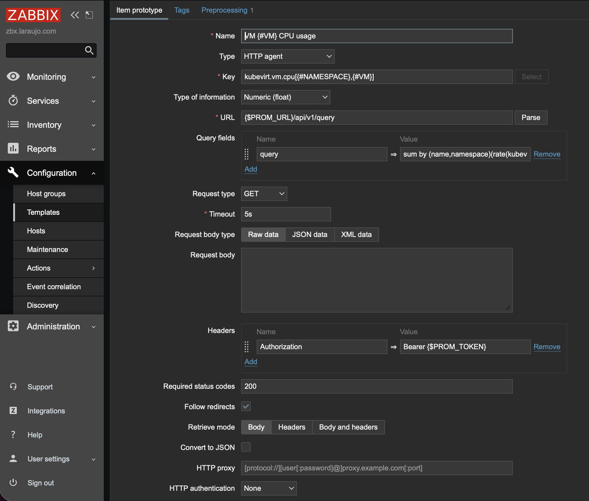


- Click on `Preprocessing` > `Add` > In Name, select `Javascript` > click on `Parameters` and add the script below:

```javascript
var obj = JSON.parse(value);

if (obj.data.result.length === 0) {
  return 0;
}

return obj.data.result[0].value[1];
```

> [!NOTE]
> _This script processes the collected information; if the VM has no CPU usage data, it will be displayed as 0._


- Click `Add` to save our Preprocessing and click `Add` again to save our Item.

&nbsp;

- Now, to speed up the creation of new items, let's clone this one, click on the created item and at the bottom of the page click on `Clone`.

- In this Item, we will update the following fields::
    - Name: _`VM {#VM} CPU total`_
    - Key: _`kubevirt.vm.cpu.request[{#NAMESPACE},{#VM}]`_
    - Type of Information: _`Numeric (unsigned)`_
    - Query fields: _Promql to collect CPU Total from VMs_
        - Name: _`query`_
        - Value: _`max by (namespace, name) (kubevirt_vm_resource_requests{resource="cpu", name="{#VM}", namespace="{#NAMESPACE}"} )`_

> [!NOTE]
> _The remaining fields should remain the same._

- Click on `Preprocessing` > `Add` > In Name, select `JSONPath` > click on `Parameters` and add the value `$.data.result[0].value[1]`

- Click `Add` to save our Preprocessing and click `Add` again to save our Item.


&nbsp;


- Repeat the cloning process and add the items below.

    - **Memory Usage**
        - Name: _`VM {#VM} Memory Usage`_
        - Key: _`kubevirt.vm.memory[{#NAMESPACE},{#VM}]`_
        - Type of Information: _`Numeric (unsigned)`_
        - Query fields: _Promql to collect Memory Usage from VMs_
            - Name: _`query`_
            - Value: _`sum by (name,namespace)(kubevirt_vmi_memory_used_bytes{name="{#VM}",namespace="{#NAMESPACE}"})`_    
        - Preprocessing:
            - JavaScript
            - Parameter:
                ```javascript
                var obj = JSON.parse(value);
                
                if (obj.data.result.length === 0) {
                  return 0;
                    }
    
                return obj.data.result[0].value[1];
                ```

    - **Memory Total**                
        - Name: _`VM {#VM} Memory total`_
        - Key: _`kubevirt.vm.mem.request[{#NAMESPACE},{#VM}]`_
        - Type of Information: _`Numeric (float)`_
        - Query fields: _Promql to collect Memory Total from VMs_
            - Name: _`query`_
            - Value: _`max by (namespace, name)(kubevirt_vm_resource_requests{resource="memory", name="{#VM}", namespace="{#NAMESPACE}"})`_    
        - Preprocessing:
            - JSONPath
            - Parameter: `$.data.result[0].value[1]`

&nbsp;

- Create all the items you deem necessary to monitor, according to the needs of the environment.

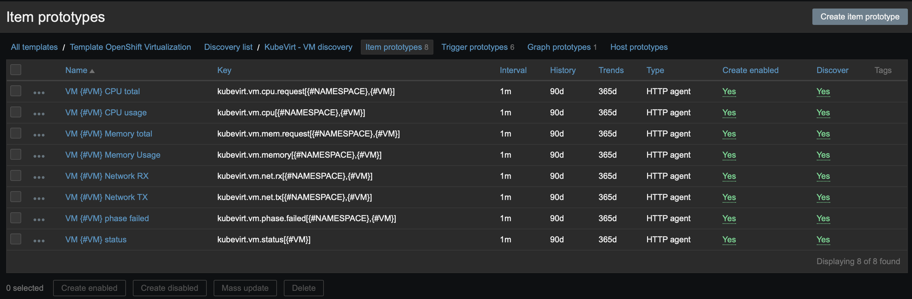

&nbsp;

#### Create Trigger Prototype

- With the `Trigger Prototype`, we will create alerts based on the collected consumption items.

- Now click on `Trigger Prototype` within the Discovery Rule created earlier or `Configuration` > `Templates` > `Template Name` created earlier > `Discovery Rule` created earlier > `Trigger prototypes` > `Create trigger prototype`

- We will fill in the following fields:
    - Name: _`VM {#NAMESPACE}/{#VM} CPU usage high >= 90%`_
    - Severity: _`High`_
    - Expression:
        ```promql
        (
        avg(/Template OpenShift Virtualization/kubevirt.vm.cpu[{#NAMESPACE},{#VM}],5m)
        /
        last(/Template OpenShift Virtualization/kubevirt.vm.cpu.request[{#NAMESPACE},{#VM}])
        ) > 0.90
        and 
        last(/Template OpenShift Virtualization/kubevirt.vm.status[{#VM}])=1
        ```
    - Description: _`VM {#NAMESPACE}/{#VM} CPU utilization: {ITEM.LASTVALUE}`_    

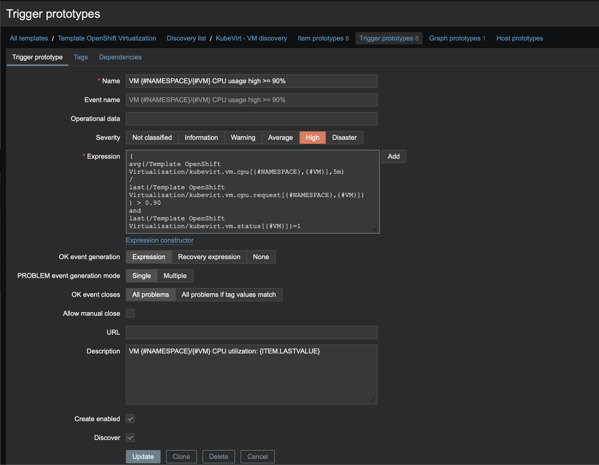

> [!NOTE]
> - _Repeat the cloning process, change the value from `0.90` to `0.70` for example, and create the alert with a Warning serverity level._
> - _In this expression, we are dividing the total by the consumption, and the result needs to be greater than 0.90 (90%), ensuring that we only do this for the VMs that are running._

&nbsp;

- Create alerts with different severities, according to the items that were discovered

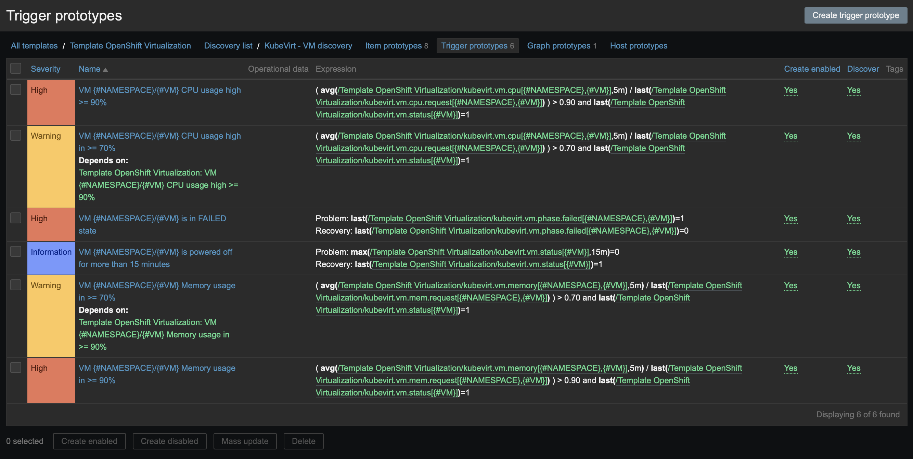

&nbsp;


#### Create Graph Prototype

- With `Graph Prototype`, we can create specific graphs, for example: a network graph.

- Now click on `Graph Prototype` within the Discovery Rule created earlier or `Configuration` > `Templates` > `Template Name` created earlier > `Discovery Rule` created earlier > `Graph prototypes` > `Create graph prototype`

- We will fill in the following fields:
    - Name: _`VM {#NAMESPACE}/{#VM} Network throughput`_
    - Items:
        - Add prototype:
            - Select the prototype items created for network RX and TX.

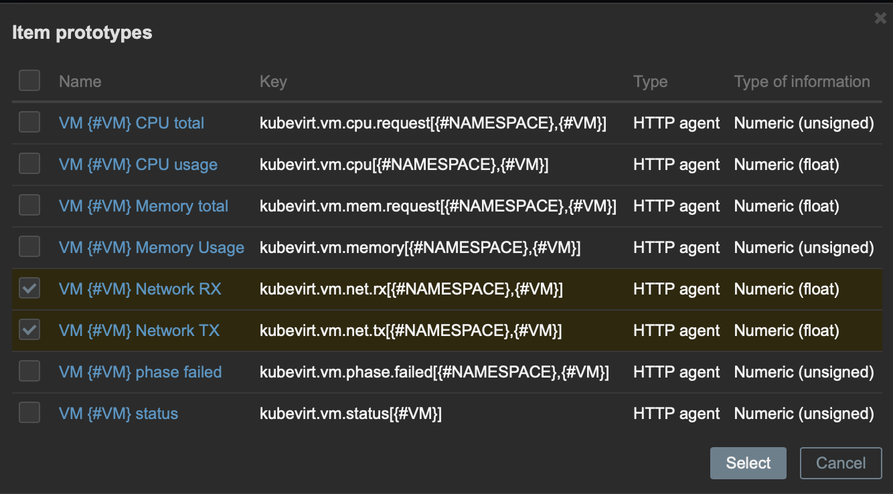

&nbsp;

- After adding the items, change the `Function` field to `avg`, adjust the item colors as desired, and click `Add`.

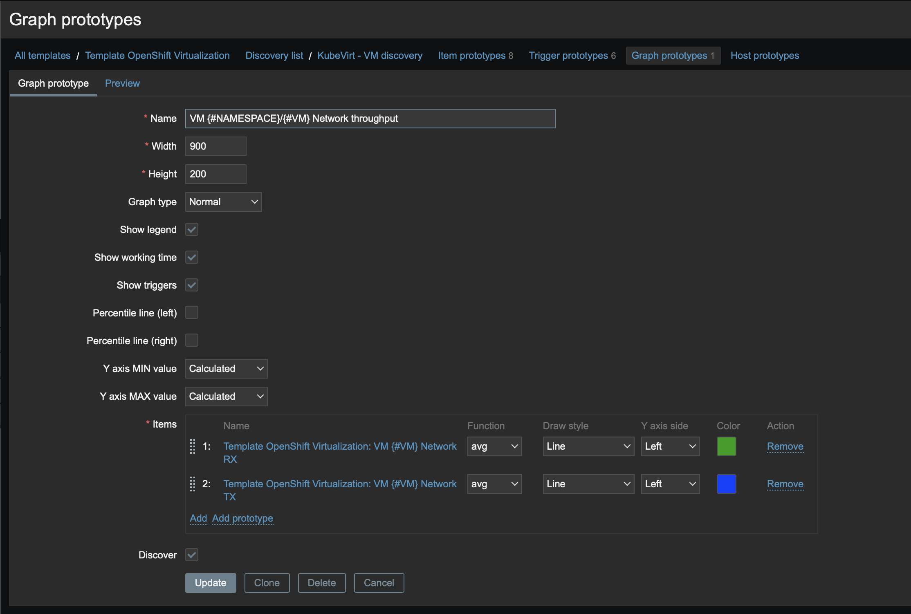

&nbsp;


- After creating some items and triggers, our discovery will look something like this.

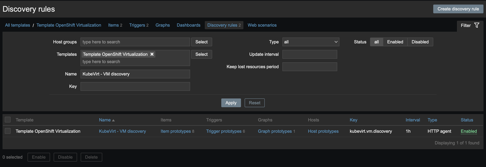


&nbsp;

#### Create Discovery Rule (LLD) for Virtual Machines

- Now, to make our monitoring more complete, let's create an LLD of nodes for virtualization, that is, nodes where the VMs are running.

- In the left side menu, click on `Configuration` > `Templates` > click on the template we created earlier > click on `Discovery rules` in the top tab > then click on `Create discovery rule`.

- We will fill in the following fields:
    - Name: _OpenShift - Node discovery_
    - Type: _Select `HTTP agent`_
    - Key: _openshift.node.discovery_
    - URL: _`{$PROM_URL}/api/v1/query`_
    - Query fields: _This field is responsible for passing our query promql to the endpoint in the URL field._
        - Name: _`query`_
        - Value: _`count by (node) (kube_node_labels{label_kubevirt_io_schedulable="true"})`_
    - Headers: _Here we will add our token for authentication to the API using our Token Macro._
        - Name: _`Authorization`_
        - Value: _`Bearer {$PROM_TOKEN}`_
    - Update interval: _`1h`, this is the frequency at which our VM discovery will be run, to discover new VMs._    

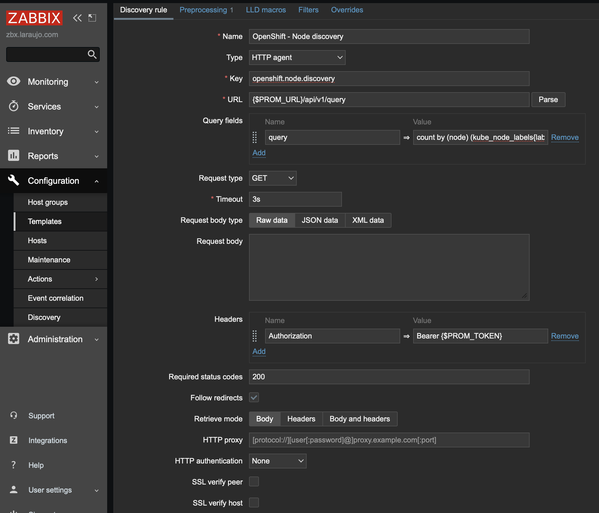

&nbsp;

- Click on `Preprocessing` > `Add` > In Name, select `Javascript` > click on `Parameters` and add the script below:

```javascript
var obj = JSON.parse(value);
var out = [];

for (var i = 0; i < obj.data.result.length; i++) {
  out.push({ "{#NODE}": obj.data.result[i].metric.node });
}

return JSON.stringify({ "data": out });
```

> [!NOTE]
> _This script will process all the output and filter only the following information: NODE Name, already creating Macros (variables) for later use._

&nbsp;

- To validate that our `Preprocessing` is working correctly, click `Test all steps`
- Check the `Get value from host` box and add the `Macros` values, adding the thanos endpoint and the bearer token, then click `Get value and test`

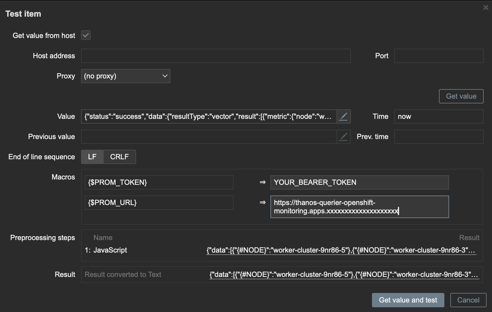

- Click `Add` to save our Preprocessing and click `Add` again to save our Item.

&nbsp;
&nbsp;

#### Create Item Prototype

&nbsp;

- With the LLD of Nodes, we can also create ITEM Prototype such as CPU, Memory, Network, Uptime, and Phase using the discovery rule's Macros (variables), **NODE**.

- Now click on `Item Prototype` within the Discovery Rule created earlier or `Configuration` > `Templates` > `Template Name` created earlier > `Discovery Rule` created earlier > `Item prototypes` > `Create Item prototype`

&nbsp;

- We will fill in the following fields:
    - Name: _`Node {#NODE} Ready status`_
    - Type: _Select `HTTP agent`_
    - Key: _`node.ready[{#NODE}]`_
    - Type of Information: _`Numeric (unsigned)`_
    - URL: _`{$PROM_URL}/api/v1/query`_
    - Query fields: _Promql to collect CPU usage from VMs_
        - Name: _`query`_
        - Value: _`max by (node) (kube_node_status_condition{ condition="Ready", status="true", node="{#NODE}" })`_
    - Headers: _Here we will add our token for authentication to the API using our Token Macro._
        - Name: _`Authorization`_
        - Value: _`Bearer {$PROM_TOKEN}`_
    - Update interval: _`30s`, this is how often our item will be collected._    

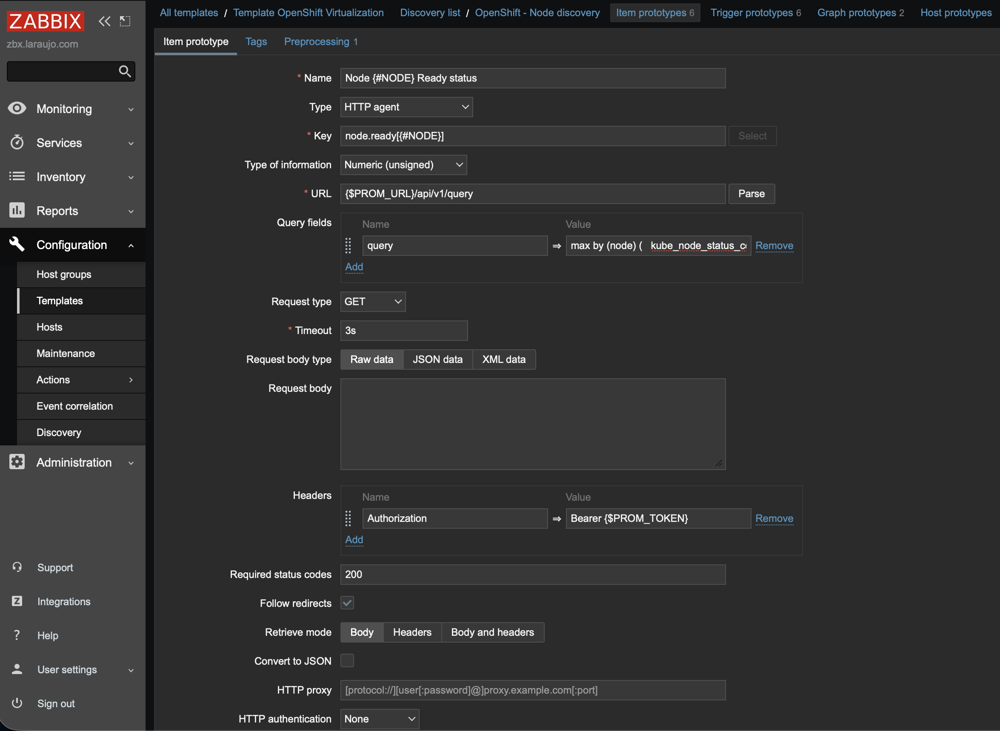

&nbsp;

- Click on `Preprocessing` > `Add` > In Name, select `Javascript` > click on `Parameters` and add the script below:

```javascript
var obj = JSON.parse(value);

if (obj.data.result.length === 0) return 0;

return obj.data.result[0].value[1];
```

> [!NOTE]
> _This JavaScript will simply ensure that we get 0 as a return value if it's null or if the value is different from what's expected._

&nbsp;

- Click `Add` to save our Preprocessing and click `Add` again to save our Item.


&nbsp;
&nbsp;

-  Repeat the previous steps to create new items, triggers, and graph prototypes.

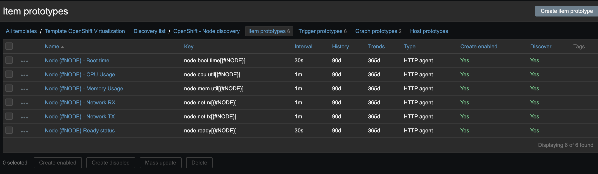
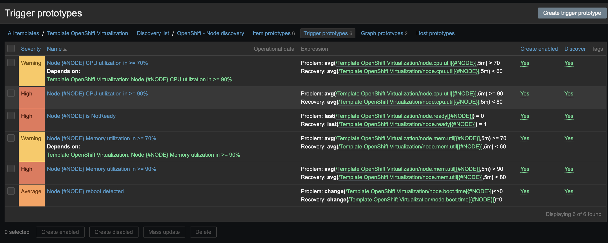
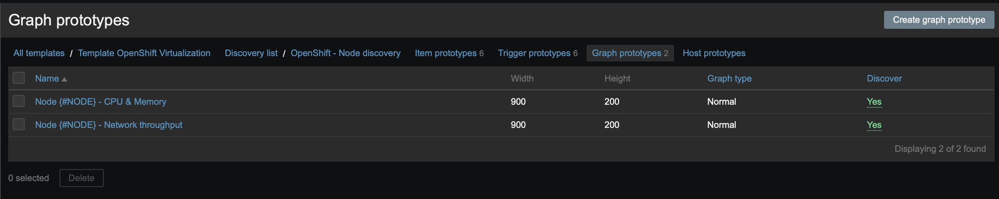


&nbsp;

- Click [HERE](./files/zbx_export_templates.xml) to download the XML for this base template.

> [!NOTE]
> _This is not a complete template; it should be used as a base and customized according to the environment/cluster._


&nbsp;

### Viewing the collected items


- Now that we have created our Host (Cluster) and the Template with the LLDs and their items, let's check if the data is being collected correctly. To do this, go to `Monitoring` > `Latest Data`.

&nbsp;

- Items collected by LLD `KubeVirt - VM discovery`
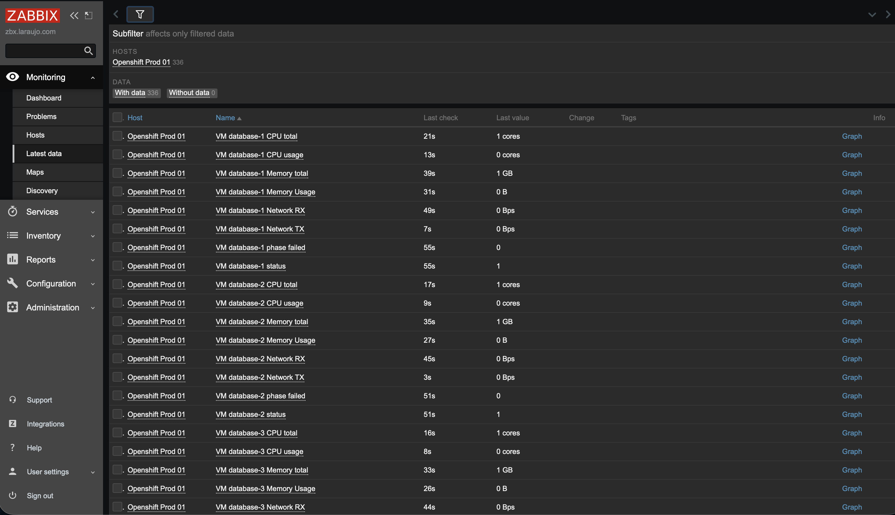

&nbsp;

- Items collected by LLD `OpenShift - Node discovery`
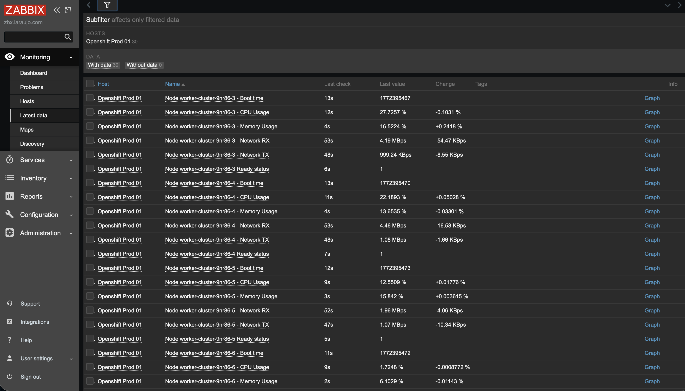


> [!NOTE]
> _It's important to note that the "Without data" filter is set to 0, meaning all items are being collected correctly._


&nbsp;
&nbsp;

### Viewing Dashboard

&nbsp;

- With all our items being collected correctly, we can view our Dashboard and identify if there are any active alerts.

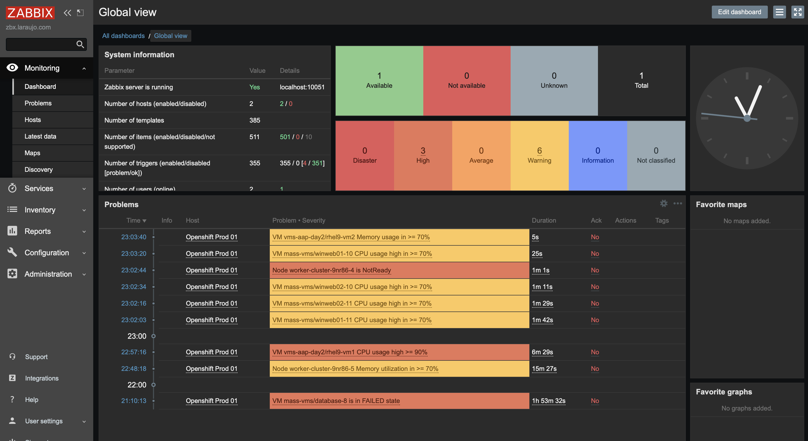

&nbsp;

## Conclusion

Monitoring OpenShift virtualization with Zabbix demonstrates how easily external tools can integrate with the platform's native observability stack. By using Prometheus and Thanos, OpenShift exposes comprehensive metrics that can be consumed by Zabbix through simple HTTP queries.

This enables effective monitoring of virtual machines and infrastructure without additional agents, using features such as LLD for dynamic discovery and automation. Ultimately, this approach combines the flexibility of Zabbix with the power of OpenShift's integrated monitoring, providing a scalable and efficient solution for modern environments.

&nbsp;

## References

For more details and other configurations, start with the reference documents below.


- [Openshift Virtualization - Monitoring](https://docs.redhat.com/en/documentation/openshift_container_platform/4.18/html/virtualization/monitoring)
- [Openshift 4.18 - Accessing metrics](https://docs.redhat.com/en/documentation/monitoring_stack_for_red_hat_openshift/4.18/html-single/accessing_metrics/index)
- [KubeVirt.io - Monitoring](https://kubevirt.io/user-guide/user_workloads/component_monitoring/)
- [Zabbix 6.0 - Low Level Discovery](https://www.zabbix.com/documentation/6.0/en/manual/discovery/low_level_discovery)
- [Zabbix 6.0 - Item HTTP Agent](https://www.zabbix.com/documentation/6.0/en/manual/config/items/itemtypes/http)
- [Zabbix 6.0 - Export and Import Templates](https://www.zabbix.com/documentation/6.0/en/manual/xml_export_import/templates)