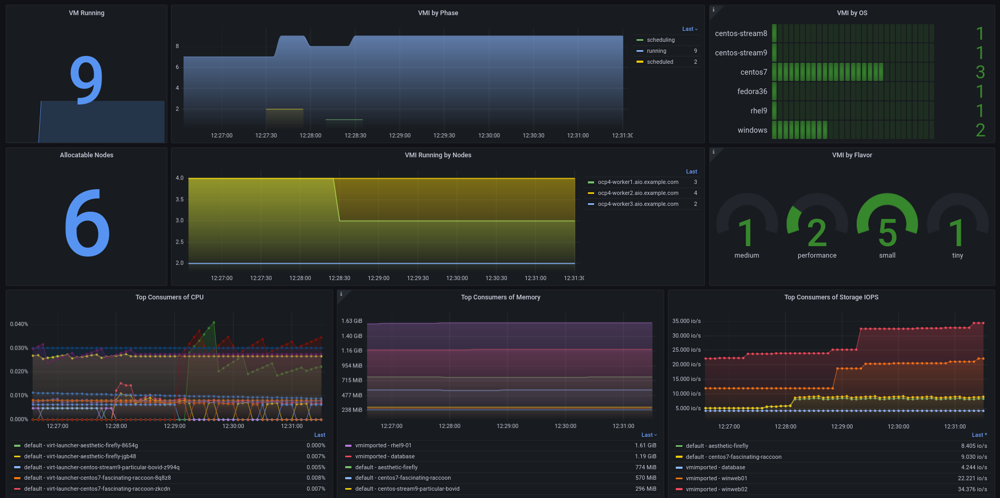
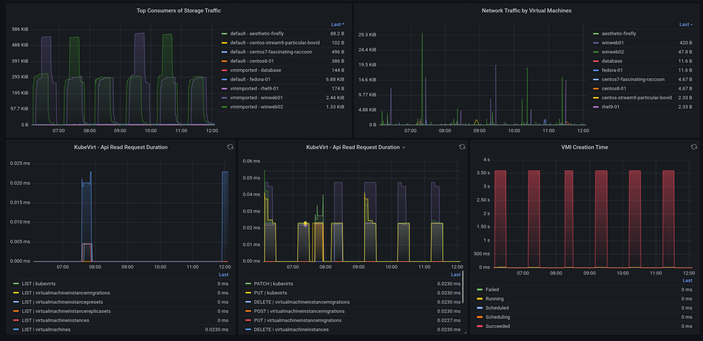

# **Monitoring Openshift Virtualization using User-Defined Projects and Grafana**

&nbsp;

> ### In this article, I will demonstrate how to monitor Red Hat Openshift Virtualization(OCP-V) using user-workload-monitoring with Prometheus(openshift-monitoring) and Grafana.


> In this article we use the following versions:
> - Openshift v4.13.4
> - Openshift Virtualization Operator v4.13.7
> - Grafana Operator v5.6.0


## **Prerequisites**

- User with the cluster-admin cluster role
- Openshift 4.12 or +
- Grafana Operator
- User-Defined Projects enabled.


## **Procedure**


### **Enable user-defined projects**

- Execute this command to add `enableUserWorkload: true` under `data/config.yaml`

```shell
$ oc -n openshift-monitoring patch configmap cluster-monitoring-config -p '{"data":{"config.yaml":"enableUserWorkload: true"}}'
```

&nbsp;

- Validate that the **prometheus** and **thanos-ruler** pods were created in the **openshift-user-workload-monitoring** project

```shell
$ oc get pods -n openshift-user-workload-monitoring
NAME                                   READY   STATUS    RESTARTS   AGE
prometheus-operator-675f9d4b96-f9zxd   2/2     Running   0          8d
prometheus-user-workload-0             6/6     Running   0          8d
prometheus-user-workload-1             6/6     Running   0          8d
thanos-ruler-user-workload-0           4/4     Running   0          8d
thanos-ruler-user-workload-1           4/4     Running   0          8d
```

&nbsp;

### **Install Grafana Operator**

- Using the **WebConsole**, in the left side menu, select **OperatorHub** and then in the search field, search for **Grafana Operator**.
- Make sure to change the project context to **openshift-user-workload-monitoring** at the top.
- Click on the operator, click on **Install**.
- In **Update Channel**, select **v5**
- In **Installation Mode**, select **A specific namespace on the cluster** and choose **openshift-user-workload-monitoring** below.
- In **Update approval**, select **Automatic**
- Click **Install**.

&nbsp;

- Now let's create a service account and assign permission to read metrics.

```shell
$ oc project openshift-user-workload-monitoring
$ oc create sa grafana-sa
$ oc adm policy add-cluster-role-to-user cluster-monitoring-view -z grafana-sa
```

- Let's collect the grafana-sa serviceaccount token and create a secret for our Grafana instance.

```shell
$ SECRET=`oc -n openshift-user-workload-monitoring describe sa grafana-sa | awk '/Tokens/{ print $2 }'`

$ TOKEN=`oc -n openshift-user-workload-monitoring get secret $SECRET --template='{{ .data.token | base64decode }}'`

$ cat <<EOF > grafana-secret-creds.yaml
kind: Secret
apiVersion: v1
metadata:
  name: credentials
  namespace: openshift-user-workload-monitoring
stringData:
  GF_SECURITY_ADMIN_PASSWORD: grafana   <------ Set the password you want to authenticate with Grafana
  GF_SECURITY_ADMIN_USER: root          <------ Set the desired user to authenticate in Grafana
  PROMETHEUS_TOKEN: '${TOKEN}'          <------ This variable will receive the token collected above
type: Opaque
EOF

$ oc create -f grafana-secret-creds.yaml
```
&nbsp;

- Now let's create our Grafana instance and it will read the credentials defined in the previously created secret.

```shell
$ cat <<EOF > grafana-instance.yaml
apiVersion: grafana.integreatly.org/v1beta1
kind: Grafana
metadata:
  name: grafana
  labels:
    dashboards: "grafana"
    folders: "grafana"
spec:
  deployment:
    spec:
      template:
        spec:
          containers:
            - name: grafana
              env:
                - name: GF_SECURITY_ADMIN_USER
                  valueFrom:
                    secretKeyRef:
                      key: GF_SECURITY_ADMIN_USER
                      name: credentials
                - name: GF_SECURITY_ADMIN_PASSWORD
                  valueFrom:
                    secretKeyRef:
                      key: GF_SECURITY_ADMIN_PASSWORD
                      name: credentials
  config:
    auth:
      disable_login_form: "false"
      disable_signout_menu: "true"
    auth.anonymous:
      enabled: "false"
    log:
      level: warn
      mode: console
EOF
```

&nbsp;

- Let's apply and validate our created Instance
```shell
$ oc -n openshift-user-workload-monitoring create -f grafana-instance.yaml

$ oc -n openshift-user-workload-monitoring get pods -l app=grafana
NAME                                READY   STATUS    RESTARTS   AGE
grafana-deployment-dd8d8d5d-vpnjh   1/1     Running   0          8d
```

&nbsp;

- Now let's expose our grafana service using an edge type route, we will use the service called **grafana-service**.

```shell
$ oc get svc | awk '/grafana/'
grafana-service                           ClusterIP   172.30.77.139    <none>        3000/TCP                      8d


$ oc -n openshift-user-workload-monitoring create route edge grafana --service=grafana-service --insecure-policy=Redirect
```
&nbsp;

- Displaying the route exposed to Grafana

```shell
$ oc -n openshift-user-workload-monitoring get route grafana -o jsonpath='{.spec.host}'
```
&nbsp;

- Let's create our **Grafana Datasource**, which will connect to **thanos-querier** in the **openshift-monitoring** project and will use the **grafana-sa** serviceaccount token that is stored in secret **credentials**.

```shell
$ cat <<EOF > grafana-datasource.yaml
apiVersion: grafana.integreatly.org/v1beta1
kind: GrafanaDatasource
metadata:
  name: grafana-ds
  namespace: openshift-user-workload-monitoring  
spec:
  valuesFrom:
    - targetPath: "secureJsonData.httpHeaderValue1"
      valueFrom:
        secretKeyRef:
          name: "credentials"
          key: "PROMETHEUS_TOKEN"
  instanceSelector:
    matchLabels:
      dashboards: "grafana"
  datasource:
    name: Prometheus
    type: prometheus
    access: proxy
    url: https://thanos-querier.openshift-monitoring.svc:9091
    isDefault: true
    jsonData:
      "tlsSkipVerify": true
      "timeInterval": "5s"
      httpHeaderName1: 'Authorization'
    secureJsonData:
      "httpHeaderValue1": "Bearer ${PROMETHEUS_TOKEN}"
    editable: true
EOF
```

&nbsp;

- Let's apply and validate our created Datasource
```shell
$ oc -n openshift-user-workload-monitoring create -f grafana-datasource.yaml

$ oc -n openshift-user-workload-monitoring get GrafanaDatasource  
NAME         NO MATCHING INSTANCES   LAST RESYNC   AGE
grafana-ds                           56s           8d
```

&nbsp;


### **Creating Grafana Dashboard**

- Now let's create a grafana dashboard, which will fetch the json externally from github.

```shell
$ cat <<EOF > grafana-dashboard-ocp-v.yaml
apiVersion: grafana.integreatly.org/v1beta1
kind: GrafanaDashboard
metadata:
  name: grafana-dashboard-ocp-v
  labels:
    app: grafana
spec:
  instanceSelector:
    matchLabels:
      dashboards: grafana  
  folder: "Openshift Virtualization"      
url: https://raw.githubusercontent.com/leoaaraujo/articles/openshift-virtualization-monitoring/files/ocp-v-dashboard.json
EOF
```
&nbsp;

- Let's apply and validate our created GrafanaDashboard

```shell
$ oc -n openshift-user-workload-monitoring create -f grafana-dashboard-ocp-v.yaml


$ oc -n openshift-user-workload-monitoring get grafanadashboard
NAME                    NO MATCHING INSTANCES   LAST RESYNC   AGE
grafana-dashboard-aap                           3s            145m
```


&nbsp;

### **Viewing the Dashboard**

- Access Grafana, in the left side menu, click on **Dashboards** and then on **Browse**
- A folder with the name **Openshift Virtualization** and the dashboard **OCP Virt - Metrics** will be displayed, click on dashboard.

&nbsp;

- Dashboard


&nbsp;
