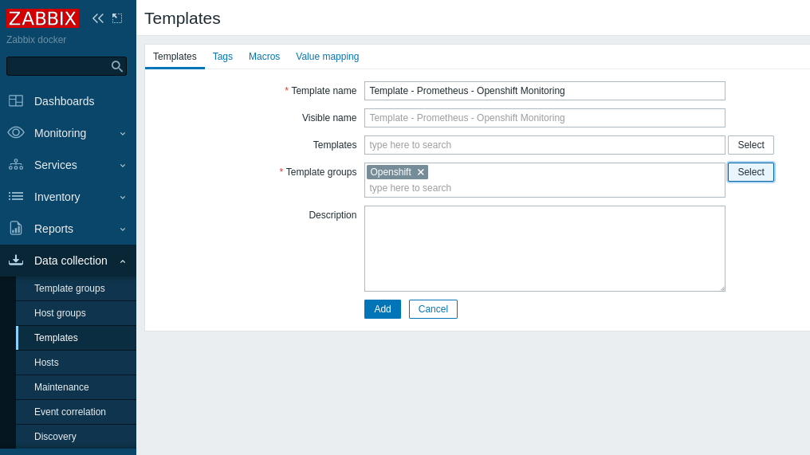

# **Monitoring Openshift using Zabbix and Prometheus API**

&nbsp;

> ### In this article, I will demonstrate how to use the Prometheus/Thanos API to collect metrics and monitor through Zabbix, where we will use the Low Level Discovery feature to create our items and triggers.
>
> In this article we use the following versions:
> - Openshift v4.13.1
> - Zabbix 6.4.6


&nbsp;

| :exclamation:  Installation of the Zabbix will not be covered. |
|------------------------------------------|


&nbsp;

## **About**

- This article is aimed at users who need to create and monitor their **Openshift Cluster** using **Zabbix**, creating capacity alerts, applications, etc.

- We will use **Zabbix** to connect to the **Prometheus/Thanos API** and have access to all metrics available in the environment, such as etcd metrics, pods, containers, infrastructure and custom applications.

- We will create a template using the `LLD` (Low Level Discovery) resource, which will process the collection of metrics that we will define and create the items and triggers.


## **Prerequisites**

- User with the cluster-admin cluster role
- Openshift 4.12 or +
- Zabbix Server


## **Procedure**

### Openshift

#### Creating a ServiceAccount

- In Openshift, let's create a ServiceAccount to use in our Zabbix connection to Prometheus/Thanos.
- Using the oc cli, connect to Openshift and follow the steps below.

```shell
$ oc project openshift-monitoring
$ oc create sa zabbix-sa
$ oc adm policy add-cluster-role-to-user cluster-monitoring-view -z zabbix-sa
```

- Let's collect the zabbix-sa serviceaccount token.

```shell
$ SECRET=`oc -n openshift-monitoring describe sa zabbix-sa | awk '/Tokens/{ print $2 }'`

$ oc -n openshift-monitoring get secret $SECRET --template='{{ .data.token | base64decode }}'
```

- Collect Thanos Endpoint
```shell
$ oc get route thanos-querier -n openshift-monitoring -o jsonpath='{.spec.host}'
```


### Zabbix

#### Create Host Group

- Let's create a Host Group to organize and create our openshift hosts to monitor.

- To do this, in the left side menu, click on `Data collection` > `Host groups` > `Create host group` > define the `Group name` and click `Add`


&nbsp;

#### Create Template

- Now let's create a template to be able to reuse our monitoring on other hosts.

- In the left side menu, click on `Data collection` > `Templates` > `Create template` > define the `Template name` > in `Template groups` enter the name you want and click on the `new` option that will appear, then click on `ADD`.



&nbsp;


#### Create Item

- Let's create our first item, in it we will define our Prometheus/Thanos endpoint, token for authentication and which metric we would like to create our first LLD

- In the left side menu, click on `Data collection` > `Templates` > select the template created previously > click on `Items` at the top and then click on `Create item`.

- Let's create an item that will query the state of all ClusterOperators


| Field       | Value       | Description |
| ----------- | ----------- | ----------- |
| Name        | Get ClusterOperators | Define a name that facilitates what this data collection refers to |
| Type        | HTTP agent  | This is a collection using API via http request. |
| Key         | prom.get.operators | Define a unique identifier |
| Type of information | Text | Text type due to the amount of information that will be collected |
| URL | `{$PROMETHEUS_OCP}`/api/v1/query| Let's add a Macro (variable) that will receive the Prometheus or Thanos endpoint | 
| Query fields | query = `cluster_operator_up{name=~".*"}` | In name we define it as query and the value will receive the promql query that we want to use in our collection|
| Request type | GET | Type GET because it is a collection query |
| Request body type | Raw data | We will process our data in the next step. |
| Headers | Authorization = {$TOKEN} | We will use authentication with bearer token, we add Authorization which will receive a macro called token |
| Update interval | 1m | Set the collection interval as needed |
| History storage period | 1h | Set the Storage period as needed |

&nbsp;


&nbsp;

- After filling in the suggested fields, click on the Preprocessing tab and click Add

    - JSONPath:
        - Set JSONPath in Name
        - In Parameter add this `$.data.result[*]`
    - JavaScript:
        - Set JavaScript in Name
        - In Parameter add this block
        - ```javascript
            output = JSON.parse(value).map(function(js){
                return {
                    "operator": js.metric.name,
                    "state": js.value[1]
                }})
            return JSON.stringify({"data": output})
           ```


> With this script, we are filtering the entire output of our collection and displaying only the operator name and state

&nbsp;

- To validate that our `Preprocessing` is working correctly, click `Test all steps`
- Check the `Get value from host` box and add the `Macros` values, adding the thanos or prometheus endpoint and the bearer token, then click `Get value and test`


- In `Result`, we can validate our processed output and only with the data selected in `javascript`.

- After completing the necessary tests, close the test window and click Update to save our Item.


&nbsp;


#### Create Discovery rules

- Let's create our Discovery, which will process the data collected by the Item we created in the last step and dynamically create our items and triggers.

- Still within the Template, click on `Discovery rules` > `Create discovery rule`

| Field       | Value       | Description |
| ----------- | ----------- | ----------- |
| Name        | LLD Cluster Operator UP | Define a name that facilitates what this LLD refers to |
| Type        | Dependent item  | LLD depends on collecting the previously created Item. |
| Key         | lld.get.co | Define a unique identifier |
| Master item | Item name | Select the Item created earlier, it will provide the data to be processed. |
| Keep lost resources period | 1d | Set the desired time |


- Now click on LLD macros, we will add two macros to receive the operator and state data, which we defined in our javascript.

- Click `Add`, create the two macros listed below and click `Update`:
    - `{#OPERATOR}` => `$.operator`
    - `{#STATE}` => `$.state` 


&nbsp;

- After clicking Update, click Item prototypes and then Create item prototype


&nbsp;

- Now let's create our Item Prototype, it's a template for dynamic item creation, let's fill in the fields below

| Field       | Value       | Description |
| ----------- | ----------- | ----------- |
| Name        | Cluster Operator {#OPERATOR} Status | In this field, we can use our Macros to customize the created item |
| Type        | Dependent item  | LLD depends on collecting the previously created Item. |
| Key         | lld.co.get.sts[{#OPERATOR}] | Define a new unique key and enter the OPERATOR macro, which will be used as a query parameter. |
| Type of information | Numeric (unsigned) | Here we define it as Numeric, as we will only display the state value, which receives numeric data |
| Master item | Item name | Select the Item created earlier, it will provide the data to be processed. |


&nbsp;

- Click on `Preprocessing` and then `Add`, we will add the below preprocessing step and click `Update`.
    - `JSONPath` => `$.data[?(@.operator=='{#OPERATOR}')].state.first()`

> In this parameter, we are filtering the output informing that the operator will be equal to the value of the OPERATOR macro and that for this operator, we want to display only the state value.    


&nbsp;


- Now click on `Trigger prototype`, here we will create our alert, for when there is a degraded operator


&nbsp;

- Click on `Create trigger prototype` and fill in the data below

| Field       | Value       | Description |
| ----------- | ----------- | ----------- |
| Name        | Cluster Operator {#OPERATOR} Degraded | In this field, we can use our Macros to customize the created trigger |
| Severity        | Average  | Set the desired severity. |


- To add the `Expression`, click `Add`, fill in the fields below and click `Insert`:
  - **Item** => click on `Select prototype` and select the prototype item created previously
  - **Function** => We will use `last()` to use the most recent value in our expression
  - **Result** => We will create an expression that informs us when the value of last() is different (<>) from 1

  


- When finished, our Trigger Prototype will look like this and click Update.

  

&nbsp;

#### Create Host

- Now let's create our Host, which will be responsible for providing the thanos endpoint and the token for Zabbix and will receive our template.

- To do this, go to the left side menu > `Data collection` > `Hosts` > `Create host` and fill in the data below


| Field       | Value       | Description |
| ----------- | ----------- | ----------- |
| Host name   | OCP - Demo Monitoring | Specify the desired host name for the host |
| Templates   | Template - Prometheus - Openshift Monitoring  | Select the Template we just created |
| Host groups | Openshift | Select the Host Group we just created |
| Interfaces  | Agent     | Let's add an agent-type interface, using ip 127.0.0.1 |

&nbsp;

  

&nbsp;

- Click on Macros at the top, we will add two Macros, the first will receive our thanos-querier endpoint and the second will receive the zabbix-sa serviceaccount token, both collected in the first step of this article.

- Click Add and add the following macros:

| Macro       | Value       | Description |
| ----------- | ----------- | ----------- |
| `{$PROMETHEUS_OCP}`   | `https://thanos-querier-openshift-monitoring.apps.cluster.domain.com` | Add the thanos-querier route using https:// |
| `{$TOKEN}`   | `Bearer YOUR_TOKEN_HERE`  | Add the zabbix-sa serviceaccount TOKEN, following this format |

 

&nbsp;

- Click Update to finish creating the host and let's wait until the LLD is executed.

- Once the LLD is executed, Items and Triggers will be created on the host, to validate, click on Items

 

&nbsp;


- Here we can view all the items created, each ClusterOperator has its respective trigger, created through LLD.

 

&nbsp;


- To validate what data is being collected, in the left side menu, click `Monitoring` > `Latest data`.

- Here we can view information such as item, last check and the last value collected


 

&nbsp;

#### Dashboard

- Now let's validate that our triggers are working correctly, click on Dashboard in the left side menu

 

&nbsp;

- Repeat the process to create new collections, identify which metrics can be useful for your monitoring and your business.

 


## **Conclusion**

Using the Prometheus/Thanos API and Low Level Discovery, we can collect metrics from our Openshift Cluster, create alerts, SLA's, availability reports and Graphs according to your business rule or need.


## **References**

For more details and other configurations, start with the reference documents below.

- [Zabbix 6.4 - Low Level Discovery](https://www.zabbix.com/documentation/current/en/manual/discovery/low_level_discovery)
- [Openshift 4.13 - Creating service accounts](https://access.redhat.com/documentation/en-us/openshift_container_platform/4.13/html/authentication_and_authorization/understanding-and-creating-service-accounts#service-accounts-managing_understanding-service-accounts)


To understand other possibilities for monitoring Openshift Clusters using Zabbix and Prometheus, read the articles below.
  - [Monitoring Infrastructure Openshift 4.x Using Zabbix Operator](https://cloud.redhat.com/blog/monitoring-infrastructure-openshift-4.x-using-zabbix-operator)
  - [How to Monitor Openshift 4.x with Zabbix using Prometheus - Part 2](https://cloud.redhat.com/blog/how-to-monitoring-openshift-4.x-with-zabbix-using-prometheus-part-2)
